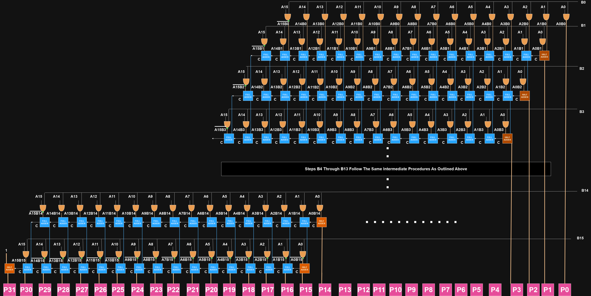

# 16-BIT COMBINATIONAL MULTIPLIER 

### Why Combinational Multipliers Are Used

Combinational multipliers are crucial in digital systems due to their speed and efficiency in performing multiplication operations. Unlike sequential multipliers, combinational multipliers do not rely on clock cycles to complete their operations, allowing them to provide immediate results. This characteristic makes them ideal for high-speed arithmetic operations required in processors, digital signal processing, and various real-time applications.

## Basic Working

A combinational multiplier works by summing partial products, which are generated by multiplying individual bits of the multiplier with the multiplicand. The partial products are then summed using an array of adders, typically full adders, to produce the final product.

## File Descriptions

- **combinational_multiplier.sv**: Contains the main multiplier logic.
- **full_adder.sv**: Full adder module.
- **half_adder.sv**: Half adder module.
- **TB.sv**: Testbench for simulating the multiplier.
- **Makefile**: Makefile for compiling and running simulations.

## Design Overview

The design consists of the following modules:
- `half_adder`: Computes the sum and carry of two bits.
- `full_adder`: Computes the sum and carry of three bits (including carry-in).
- `combinational_multiplier`: The main module that computes the product of two 16-bit signed integers.

### Block Diagram



The 16-bit combinational multiplier design shown above follows a structured approach to generate and sum the partial products. The design includes:

- **AND Gates**: Used to generate the partial products for each bit pair.
- **Half Adders and Full Adders**: Utilized to sum the partial products and carry bits effectively.

The intermediate steps from B7 to B14 follow the same procedures as outlined above from B1 to B3, ensuring consistency and completeness.

### Design Optimization

In the optimized design, we have reduced the number of full adders by complementing the result of the last bit of 'A' from above adder, thus reducing hardware complexity and improving performance. 

## Example: 3-bit Multiplication

To illustrate the concept, let's consider a 3-bit example with `A = 3` (binary `011`) and `B = 2` (binary `010`).

### Step-by-Step Calculation

1. **Binary Representation**:
   - `A` = `011` (3 in decimal)
   - `B` = `010` (2 in decimal)

2. **Partial Product Generation**:
   - **Partial Product 1**: `A * B[0]` = `A * 0`
     - `011 * 0` = `000` 
     - Invert MSB bit: `100`
     - Final: `100`
   - **Partial Product 2**: `A * B[1]` = `A * 1`
     - `011 * 1` = `011` (Shifted left by 1 position)
     - Invert MSB bit: `110`
     - Final: `1100`
   - **Partial Product 3**: `A * B[2]` = `A * 0`
     - `011 * 0` = `000` (Shifted left by 2 positions)
     - Invert all bits except MSB: `000` becomes `111`
     - Final: `11100`

3. **Summation of Partial Products**:
   - Final product: Add the partial products

## Running the Tests

To run the tests, you need a Verilog simulator like ModelSim or any other compatible tool. Here are the steps to run the tests:

1. **Compile the source files**:
   ```bash
   make 

