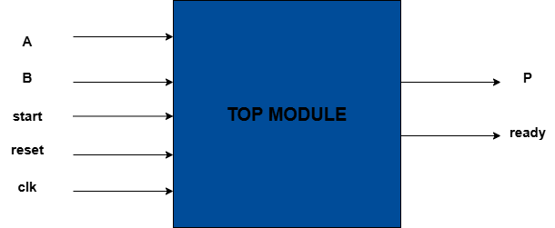
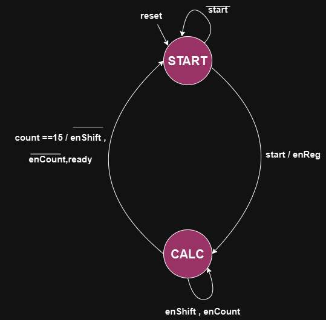

# Sequential Signed Multiplier Project with Python Test 

## Introduction

This project implements a sequential multiplier using Verilog, consisting of two main components: the Control Unit and the Data Path. The system multiplies two 16-bit signed numbers sequentially and outputs a 32-bit signed product. The project also includes a testbench for verification using Cocotb.

## What is Cocotb?

Cocotb (Coroutine-based Co-simulation Testbench) is a Python library that allows you to write testbenches for your HDL code (e.g., Verilog, VHDL) in Python. It leverages the simulator's VPI/VHPI interface to provide an efficient way to drive and monitor signals in your design. Cocotb is particularly useful for writing complex testbenches, as it provides a high-level, Pythonic interface for interacting with your HDL.

## Prerequisites

- Verilog/SystemVerilog simulator (e.g., Icarus Verilog)
- Python 3.x
- Cocotb library

## Installation

### Cocotb

To install Cocotb, you can use pip:

```sh
pip install cocotb
```

### Icarus Verilog

To install Icarus Verilog, follow these steps:

On Ubuntu:

```sh
sudo apt-get update
sudo apt-get install iverilog
```

On macOS (using Homebrew):

```sh
brew install icarus-verilog
```

### Setting Up Cocotb in a Virtual Environment

1. Create a virtual environment:

    ```sh
    python -m venv myenv
    ```

2. Activate the virtual environment:

    On Windows:

    ```sh
    myenv\Scripts\activate
    ```

    On Unix or macOS:

    ```sh
    source myenv/bin/activate
    ```

3. Install Cocotb in the virtual environment:

    ```sh
    pip install cocotb
    ```

## Running the Testbench

To run the testbench, use the following command:

```sh
make SIM=icarus
```

This command runs the simulation using Icarus Verilog and executes the Cocotb testbench.

## Viewing Waveforms

To generate waveforms for viewing, ensure your Makefile includes commands to dump VCD files. Once the simulation is complete, you can use GTKWave to view the waveform:

```sh
gtkwave waveform.vcd
```

## Project Structure

- **Top Module**: Integrates the Control Unit and Data Path, managing the overall operation.
- **Control Unit**: Manages the state transitions and control signals for the multiplication process.
- **Data Path**: Performs the actual multiplication operation, utilizing registers and combinational logic.

### Top Module

The Top Module integrates the Control Unit and Data Path, coordinating the overall multiplication process.

#### Inputs

- `clk`: Clock signal.
- `reset`: Reset signal to initialize the state.
- `start`: Signal to start the multiplication process.
- `A`, `B`: 16-bit input values to be multiplied.

#### Outputs

- `P`: 32-bit product of the multiplication.
- `ready`: Indicates when the multiplication is complete.

<p align="center">
  
</p>

### Control Unit

The Control Unit handles the state transitions between different stages of the multiplication process, including initialization, calculation, and completion.

#### Inputs

- `clk`: Clock signal.
- `reset`: Reset signal to initialize the state.
- `start`: Signal to start the multiplication process.
- `count`: Counter value indicating the current step in the multiplication.

#### Outputs

- `enReg`: Enable signal for loading inputs into registers.
- `enCount`: Enable signal for the counter and calculation operations.
- `enShift`: Enable signal for shifting the calculated product for each count.
- `ready`: Indicates when the multiplication is complete.

#### State Diagram

The Control Unit operates in a finite state machine with the following states:

1. **START**: Waits for the start signal. On receiving the start signal, it transitions to the CALC state.
2. **CALC**: Performs the multiplication by iterating through the bits of the multiplicand. The state transitions back to START after completion.

<p align="center">
  
</p>

### Data Path

The Data Path module performs the multiplication operation by accumulating partial products and computing the final result `P`.

#### Inputs

- `clk`: Clock signal.
- `reset`: Reset signal to initialize registers.
- `enReg`: Enable signal to load the input values into internal registers.
- `enCount`: Enable signal to increment the count.
- `enShift`: Enable signal to perform shift operations.
- `A`, `B`: 16-bit input values to be multiplied.

#### Outputs

- `P`: 32-bit product of the multiplication.
- `count`: 4-bit counter value.

The Data Path uses registers to store the multiplicand, multiplier, and intermediate results. It shifts the multiplicand and accumulates the partial products in each clock cycle.

<p align="center">
  
</p>

## Testbench Explanation

The testbench is written using Cocotb to verify the functionality of the sequential signed multiplier. It consists of several key functions and test cases.

### Clock Generation

A clock generation coroutine (`clk_gen`) creates a continuous clock signal for the DUT (Device Under Test).

### Signed Conversion

A helper coroutine (`to_signed`) converts unsigned values to signed values, considering the bit-width of the signals.

### Test Execution

The `run_test` coroutine sets the input values, initiates the multiplication process, and checks the output against the expected result. It also logs the results of the test.

### Directed Tests

The `directed_tests` coroutine runs specific test cases with known inputs and expected outputs. It initializes the DUT, runs the directed test cases, and logs the pass/fail results.

### Random Tests

The `random_tests` coroutine performs a large number of random test cases to verify the robustness of the multiplier. It initializes the DUT, runs random test cases, and logs the pass/fail results.

By following this structure, the testbench thoroughly verifies the functionality of the sequential signed multiplier, ensuring it handles both directed and random test cases correctly.

## Running the Project
To run the project, a Makefile is provided which can be used by the following commands:

To display the final outputs just run command below, within you virtual environment

```sh
make 
```
To see waveforms run the commands below 

```sh
 gtkwave dump.vcd
```


