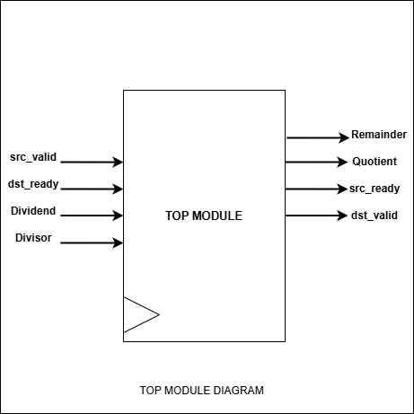
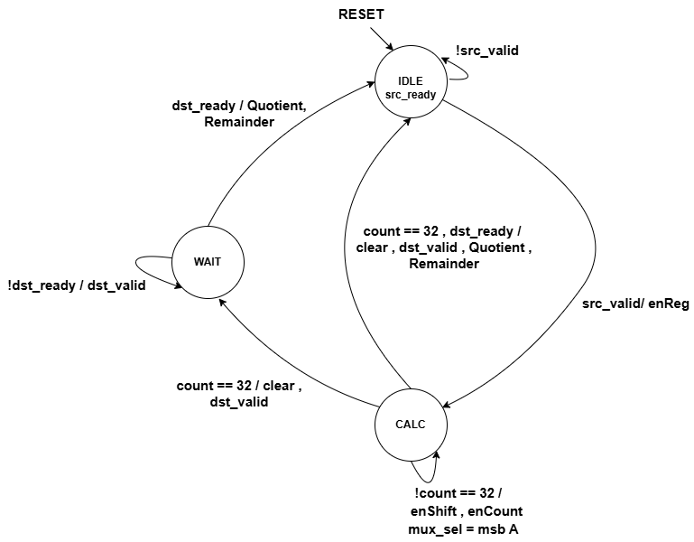
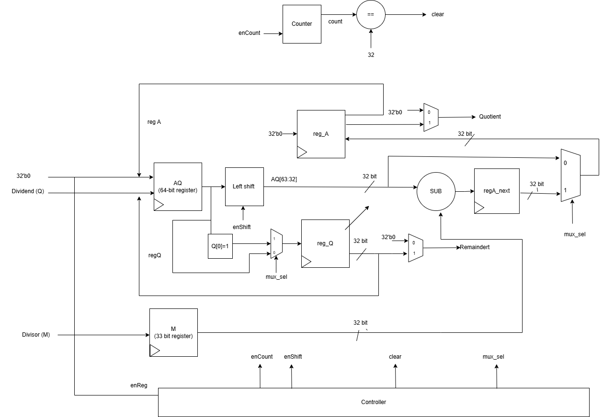

# Restoring Division Algorithm Project with Python Test

## Introduction

This project implements a restoring division algorithm using system verilog. The system divides two 32-bit unsigned numbers sequentially and outputs a 32-bit unsigned quotient and a 32-bit unsigned remainder. The project also includes a testbench for verification using Cocotb.

## What is Cocotb?

Cocotb (Coroutine-based Co-simulation Testbench) is a Python library that allows you to write testbenches for your HDL code (e.g., Verilog, VHDL) in Python. It leverages the simulator's VPI/VHPI interface to provide an efficient way to drive and monitor signals in your design. Cocotb is particularly useful for writing complex testbenches, as it provides a high-level, Pythonic interface for interacting with your HDL.

## Prerequisites

- Verilog/SystemVerilog simulator (e.g., Icarus Verilog)
- Python 3.x
- Cocotb library

## Installation

### Cocotb

To install Cocotb, you can use pip:

```bash
pip install cocotb
```

### Icarus Verilog

To install Icarus Verilog, follow these steps:

On Ubuntu:

```bash
sudo apt-get update
sudo apt-get install iverilog
```

On macOS (using Homebrew):

```bash
brew install icarus-verilog
```

## Setting Up Cocotb in a Virtual Environment

1. **Create a virtual environment:**

    ```bash
    python -m venv myenv
    ```

2. **Activate the virtual environment:**

    On Windows:

    ```bash
    myenv\Scripts\activate
    ```

    On Unix or macOS:

    ```bash
    source myenv/bin/activate
    ```

3. **Install Cocotb in the virtual environment:**

    ```bash
    pip install cocotb
    ```

## Running the Testbench

To run the testbench, use the following command:

```bash
make SIM=icarus
```

This command runs the simulation using Icarus Verilog and executes the Cocotb testbench.

## Viewing Waveforms

To generate waveforms for viewing, ensure your Makefile includes commands to dump VCD files. Once the simulation is complete, you can use GTKWave to view the waveform:

```bash
gtkwave waveform.vcd
```

## Project Structure

### Top Module
The Top Module integrates the Control Unit and Data Path, coordinating the overall division process.

#### Inputs
- `clk`: Clock signal.
- `reset`: Reset signal to initialize the state.
- `src_valid`: Indicates when the input data is valid.
- `dst_ready`: Indicates when the module is ready to output data.
- `Dividend, Divisor`: 32-bit input values to be divided.

#### Outputs
- `Quotient`: 32-bit result of the division.
- `Remainder`: 32-bit remainder after division.
- `src_ready`: Indicates when the module is ready to accept new data.
- `dst_valid`: Indicates when the output data is valid.

#### Top-Level Module Diagram

<p align="center">
  
</p>

### Control Unit
The Control Unit manages the state transitions and control signals for the division process.

#### Inputs
- **clk**: Clock signal.
- **reset**: Reset signal to initialize the state.
- **start**: Signal to start the division process.
- **count**: Counter value indicating the current step in the division.

#### Outputs
- **enReg**: Enable signal for loading inputs into registers.
- **enCount**: Enable signal for the counter and calculation operations.
- **enShift**: Enable signal for shifting the intermediate results during the division process.
- **enSub**: Enable signal for performing the subtraction operation.
- **ready**: Indicates when the division is complete.

#### State Diagram
The Control Unit operates as a finite state machine (FSM) with the following states:

- **IDLE**: The initial state where the system waits for a valid input (`src_valid`). If a valid input is detected, it loads the input into registers (`enReg = 1`) and transitions to the `CALC` state. Otherwise, it remains in the `IDLE` state.
  
- **CALC**: In this state, the division operation is performed by shifting the intermediate results and counting the steps. The `CALC` state continues to iterate through the bits of the dividend, and if the count reaches 32, the division process is complete. At this point, the system clears the registers (`clear = 1`), marks the result as valid (`dst_valid = 1`), and transitions to the `WAIT` state.
  
- **WAIT**: In this state, the system waits for the destination to be ready to accept the results (`dst_ready`). Once the destination is ready, the system transitions back to the `IDLE` state to be ready for the next operation. If the destination is not ready, the system remains in the `WAIT` state and continues to assert `dst_valid = 1`.

#### Control Unit State Diagram
<p align="center">
  
</p>

### Data Path
The Data Path module performs the actual division operation, utilizing registers and combinational logic.

#### Inputs
- **clk**: Clock signal.
- **reset**: Reset signal to initialize registers.
- **enReg**: Enable signal to load the input values into internal registers.
- **enCount**: Enable signal to increment the count.
- **enShift**: Enable signal to perform shift operations.
- **enSub**: Enable signal to perform subtraction in the division process.
- **Dividend, Divisor**: 32-bit input values to be divided.

#### Outputs
- **Quotient**: 32-bit result of the division.
- **Remainder**: 32-bit remainder after division.
- **count**: 6-bit counter value.

The Data Path uses registers to store the dividend, divisor, and intermediate results. It performs subtraction and shifts the intermediate results in each clock cycle.

#### Data Path Diagram
<p align="center">
  
</p>

## Testbench Explanation

### `testbench.py`
A Python-based testbench using Cocotb for automated verification of the division algorithm.

**Key Features:**
- Clock generation using `cocotb`.
- Functions to apply directed tests with predefined inputs and expected outputs.
- Randomized tests to validate the robustness of the design.
- Logs the results of each test, indicating pass or fail status.

*NOTE*: Current file tests the code for 100k runs.

### 6. `Makefile`
A Makefile to automate the compilation and simulation process.

**Key Commands:**
- `make`: Compiles the SystemVerilog files and runs the simulation.
- `make view`: Opens the waveform in GTKWave after the simulation completes.

### 7. `dump.vcd`
This file is generated during the simulation and contains waveform data that can be viewed using GTKWave or any other waveform viewer.

## Running the Project

To compile and simulate the design:

```bash
make
