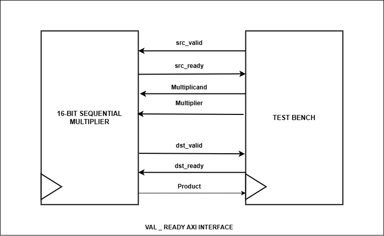

# Sequential Signed Multiplier With VAL-READY AXI INTERFACE 

## Objective

This project implements a sequential multiplier using Verilog with an AXI interface. The design includes a Top Module that integrates a Control Unit and Data Path, enabling the multiplication of two 16-bit signed numbers to produce a 32-bit signed product. The project also features a testbench for comprehensive verification.


## Project Structure

- **Top Module**: Coordinates the operation between the Control Unit and Data Path, handling AXI interface signals.
- **Control Unit**: Manages state transitions and control signals for the multiplication process.
- **Data Path**: Executes the multiplication operation, accumulating partial products to compute the final result.


### Top Module

The Top Module integrates the Control Unit and Data Path, coordinating the multiplication process and handling AXI interface signals.

#### Inputs
- `clk`: Clock signal.
- `reset`: Reset signal to initialize the module.
- `src_valid`: Signal indicating that the source data is valid.
- `dst_ready`: Signal indicating that the destination is ready to receive data.
- `A`, `B`: 16-bit input values to be multiplied where "A" is multiplicand and "B" is multiplier.

#### Outputs
- `P`: 32-bit product of the multiplication.
- `src_ready`: Indicates when the source is ready for new input data.
- `dst_valid`: Indicates when the destination has valid data available.

<p align="center">
  
</p>

### Control Unit

The Control Unit handles the state transitions between different stages of the multiplication process, including initialization, calculation, and completion.

#### Inputs
- `clk`: Clock signal.
- `reset`: Reset signal to initialize the state.
- `src_valid`: Indicates whether source data is valid.
- `dst_ready`: Indicates whether the destination is ready to receive data.
- `count`: Counter value indicating the current step in the multiplication process.

#### Outputs
- `enReg`: Enable signal for loading input values into registers.
- `enCount`: Enable signal for counting operations.
- `enShift`: Enable signal for shift operations.
- `dst_valid`: Indicates when the destination data is valid.
- `src_ready`: Indicates when the source is ready for new data.

#### State Diagram

The Control Unit operates as a finite state machine with the following states:
1. **IDLE**: Waits for the start of a new operation. Transitions to START on receiving `src_valid`.
2. **START**: Loads input data into registers and transitions to CALC.
3. **CALC**: Performs the multiplication process. Transitions to WAIT when computation is complete.
4. **WAIT**: Waits for the `dst_ready` signal to assert `dst_valid` and then returns to IDLE.

<p align="center">
  
</p>

### Data Path

The Data Path module performs the multiplication operation by accumulating partial products and computes final result 'P'.

#### Inputs
- `clk`: Clock signal.
- `reset`: Reset signal to initialize registers.
- `enReg`: Enable signal to load the input values into internal registers.
- `enCount`: Enable signal to increment the count.
- `enShift`: Enable signal to perform shift operations.
- `ready`: Signal indicating that the result is ready.
- `A`, `B`: 16-bit input values to be multiplied.

#### Outputs
- `P`: 32-bit product of the multiplication.
- `count`: 4-bit counter value.

The Data Path uses registers to store the multiplicand, multiplier, and intermediate results. It shifts the multiplicand and accumulates the partial products in each clock cycle.

<p align="center">
  
</p>

### AXI Interface

The AXI interface facilitates communication between the Top Module and external components. It follows the VAL-READY protocol to synchronize data transfers:

- **src_valid**: Indicates that the source data (A and B) is valid and ready to be processed.
- **src_ready**: Indicates that the source is ready to accept new input data.
- **dst_ready**: Indicates that the destination is ready to receive the computed product.
- **dst_valid**: Indicates that the product is available and valid for reading.

#### AXI Interface Diagram

<p align="center">
  
</p>

#### Testbench

This testbench is designed to verify the functionality of the `Top_Module`, focusing on both directed and random tests to ensure robust coverage.

## Testbench Logic

### Test Sequence

1. **Initialization**: All signals are initialized, and the reset sequence is applied to the module.
2. **Directed Tests**: A set of predefined inputs is tested to verify specific known outcomes.
3. **Random Tests**: Random inputs are generated and tested to cover a broad range of scenarios.

### Driver Task

- **Purpose**: To generate random inputs and apply them to the `Top_Module`.
- **Process**:
  1. Generate random values for inputs `A` and `B`.
  2. Call the `launch_test` task with these random values.
  3. Repeat this process for a large number of iterations (200,000 runs in this case).

### Launch Test Task

- **Purpose**: To apply a test case with specified inputs to the module.
- **Process**:
  1. Set the input values for `A` and `B`.
  2. Assert `src_valid` to indicate that valid data is being provided.
  3. Wait for the module to acknowledge readiness by monitoring the `src_ready` signal.
  4. Deassert `src_valid` after acknowledgment and wait for the module to process the inputs.

### Monitor Task

- **Purpose**: To observe the outputs of the `Top_Module` and verify the correctness of the result.
- **Process**:
  1. Assert `dst_ready` to indicate that the module is ready to provide output.
  2. Wait until `dst_valid` is asserted to ensure that valid data is available.
  3. Capture the output product and compare it with the expected result.
  4. Display the observed and expected values for verification.

### Scoreboard Task

- **Purpose**: To tally the number of passed and failed test cases based on the output of the module.
- **Process**:
  1. Check if `dst_valid` is asserted to indicate valid output.
  2. Compare the output product `P` with the expected product.
  3. Increment the pass count if the output matches the expected result, otherwise increment the fail count.

## Running the Project

### Prerequisites

To run this project, you need a SystemVerilog simulator (e.g., ModelSim).

### Makefile Commands

Run the project using commands given below:

- **Compile the project:**

  ```bash
    make compile
  
- **Simulate the project:**

  ```bash
    make simulate
  
- **Display waveform:**

  ```bash
    make waveform

- **Remove the project:**

  ```bash
    make clean
  
  
### Expected Waveform


The example waveform illustrates the data flow for a 16-bit signed sequential multiplier with a valid/ready interface. Initially, the reset (rst) signal is asserted then deasserted after one clock cycle, allowing the system to operate. The source valid (src_valid) signal indicates when input data is valid. When src_ready is high, the system reads input data values, as shown by the 16-bit input signals (input1 and input2). The product calculation begins and the output is available once dst_valid and dst_ready is asserted.If dst_ready is zero dst_valid stays asserted as shown in waveform.The product is shown in the 32-bit product signal.After one execution the src_ready is set high waiting for src_valid to be high to take new inputs.


