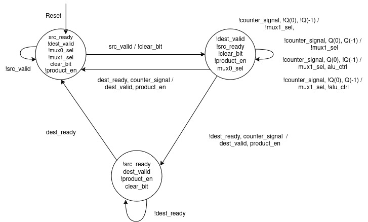
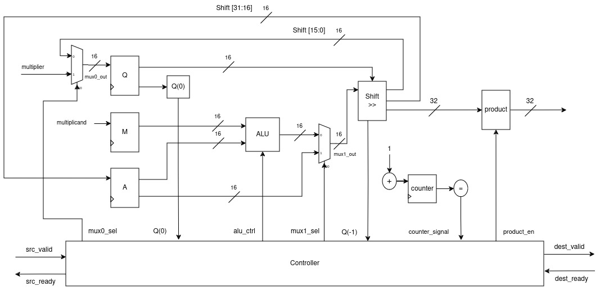

# Sequential Multiplier With Cocotb

## State Machine


## Data Path And Controller


## Pinout Diagram


# Run 
Making virtual environment
```bash
python3 -m venv venv
```
	
Activate virtual environment
```bash
source venv/bin/activate  
```

Install pytest cocotb
```bash
pip3 install pytest cocotb cocotb-bus cocotb-coverage
```

Run
```bash
make 
```

To delete files made by simulator
```bash
make clean
```

