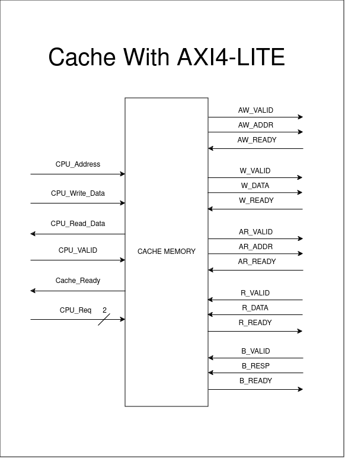
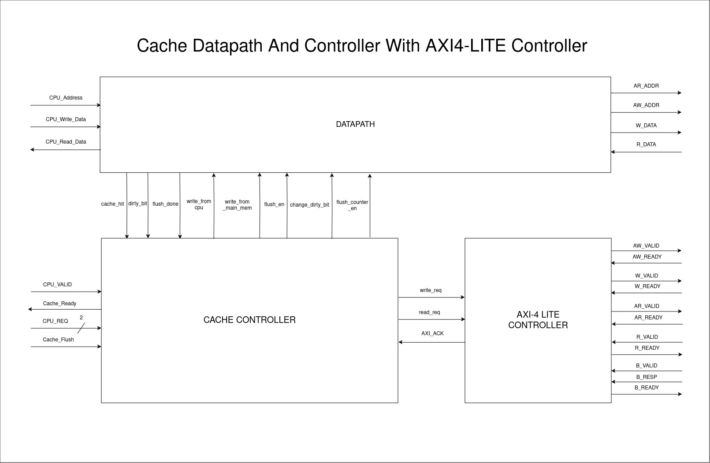
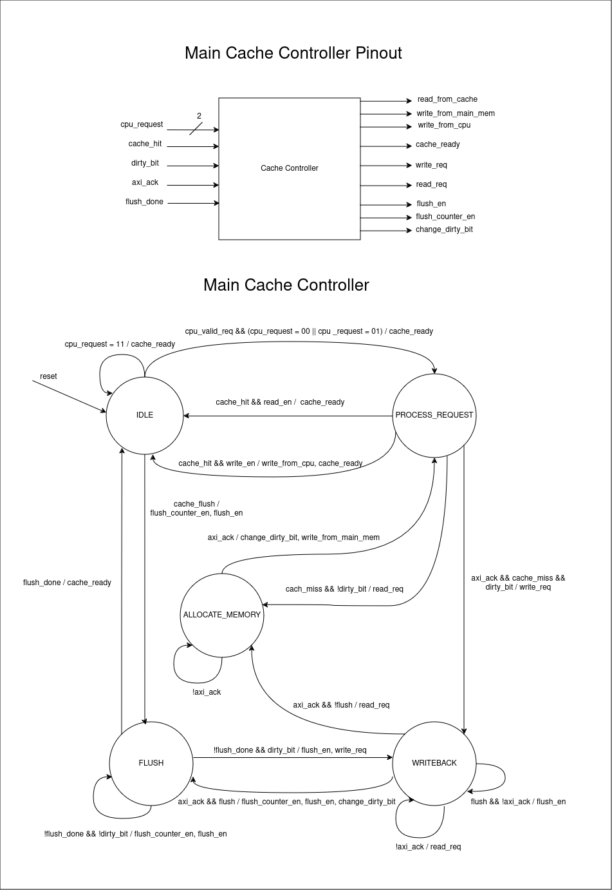
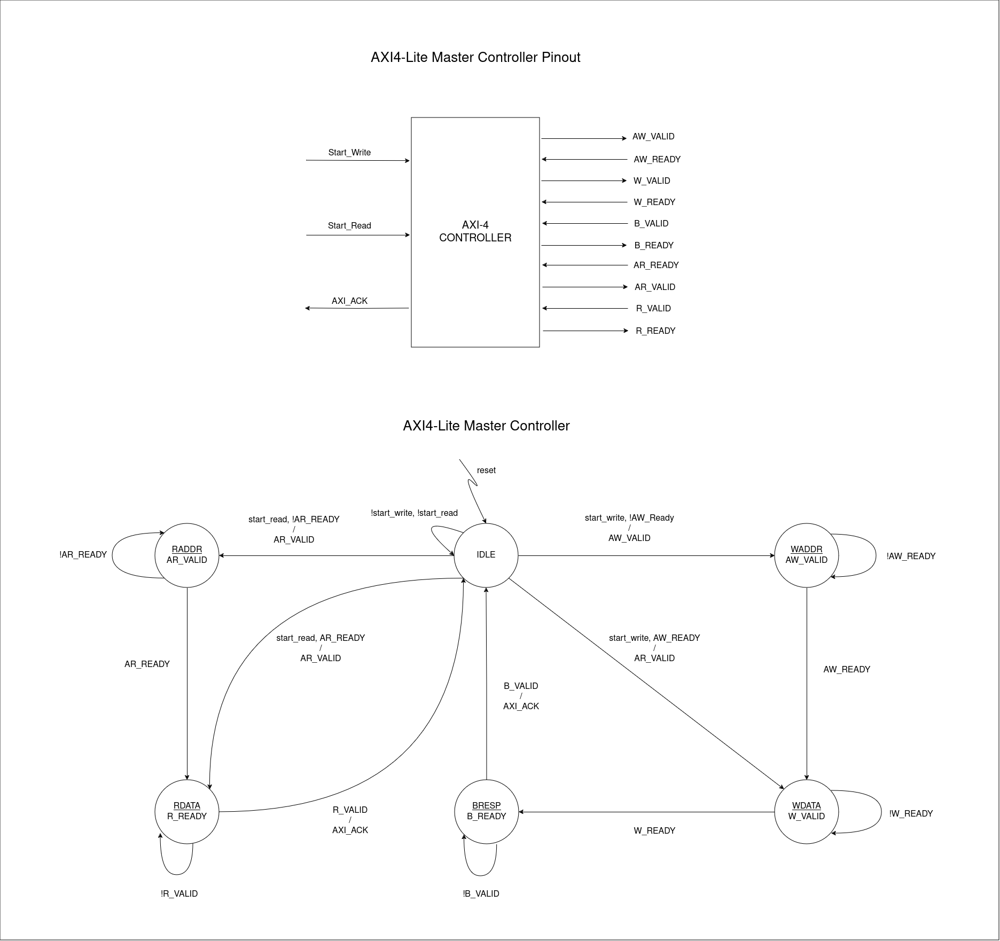

# Direct Mapped Cache With AXI-4 Lite

## Top level


## Pinout 


## Cache controller


## AXI4 Lite controller


# Run simulation
To compile design
```bash
make compile
```

To run the simulation
```bash
make simulate
```

To view simulation
```bash
make view_simulation
```

To delete files made by simulator
```bash
make clean
```

