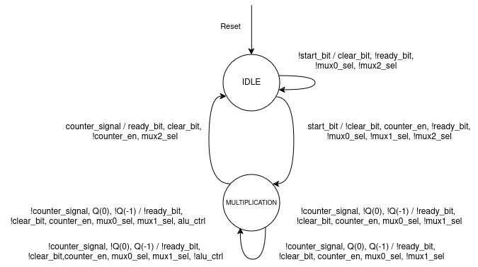

# 16bit x 16bit Sequential Multiplier

## State Machine


## Data Path and Controller


## Pinout Diagram


# Installation

Install iverilog and gtkwave
```bash
make install
```

# Run Simulation
To compile design
```bash
make compile
```

To run the simulation
```bash
make simulate
```

To view simulation
```bash
make view_simulation
```

To delete files made by simulator
```bash
make clean
```

