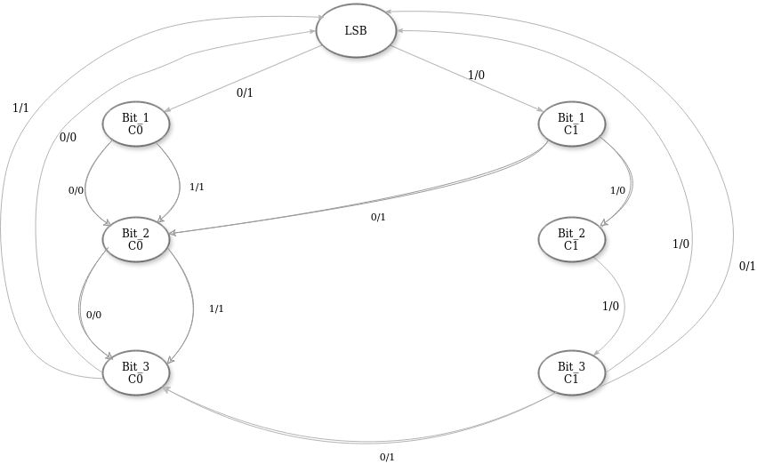
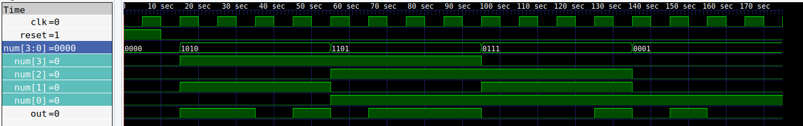

# 4-bit Sequential Adder

This implements a 4-bit sequential adder using System Verilog. The design includes state transitions to handle the addition of each bit along with the carry.

## State Transitions

- **IDLE:** Initial state, transitions to LSB.
- **LSB:** Checks the least significant bit of the input.
  - If 1, transitions to CARRY1_BIT1, output 0.
  - If 0, transitions to CARRY0_BIT1, output 1.
- **CARRY0_BIT1:** Checks the second bit of the input.
  - If 1, transitions to CARRY0_BIT2, output 1.
  - If 0, stays in CARRY0_BIT1, output 0.
- **CARRY1_BIT1:** Checks the second bit of the input.
  - If 1, transitions to CARRY1_BIT2, output 0.
  - If 0, transitions to CARRY0_BIT2, output 1.
- **CARRY0_BIT2:** Checks the third bit of the input.
  - If 1, transitions to CARRY0_BIT3, output 1.
  - If 0, stays in CARRY0_BIT2, output 0.
- **CARRY1_BIT2:** Checks the third bit of the input.
  - If 1, transitions to CARRY1_BIT3, output 0.
  - If 0, transitions to CARRY0_BIT3, output 1.
- **CARRY0_BIT3:** Checks the fourth bit of the input.
  - If 1, transitions to LSB, output 1.
  - If 0, transitions to LSB, output 0.
- **CARRY1_BIT3:** Checks the fourth bit of the input.
  - If 1, transitions to LSB, output 0.
  - If 0, transitions to LSB, output 1.

## State Transition Diagram
Here is a simple representation of the state transition diagram:


## Simulation Waveform
Follow these steps to run the simulation and view the waveform in GTKWave:


## How to use

### Compile
Compile the Verilog Code:
```
make 
```

### Simulate
Simulate the Verilog Code:
```
make simulate
```

### cleanup
```
make clean
```