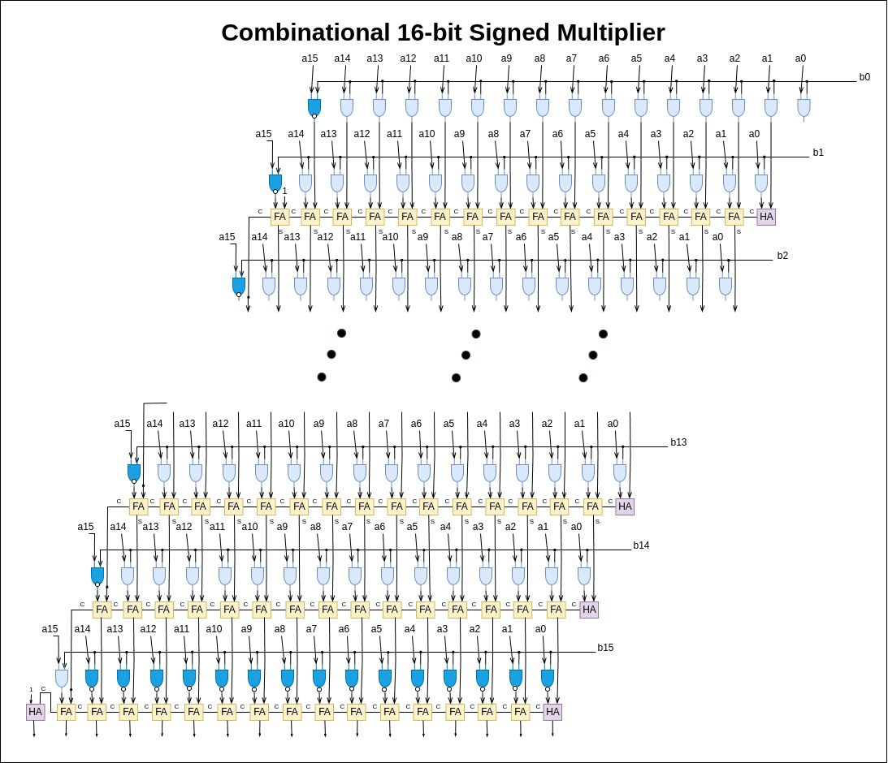

# 16-bit Combinational Signed Multiplier

This project implements a 16-bit combinational signed multiplier using SystemVerilog. The design is verified using a testbench and synthesized using Xilinx Vivado.

## Table of Contents
- [Introduction](#introduction)
- [Design](#design)
- [Dependencies](#dependencies)
- [Usage](#usage)
  - [Running Simulation](#running-simulation)
  - [Waves GUI](#waves-gui)

## Introduction
This project showcases a combinational logic design for multiplying two 16-bit signed integers. The design takes two signed 16-bit inputs and produces a signed 32-bit output.

## Design


## Dependencies
- Xilinx Vivado Design Suite
- Make

## Usage

### Running Simulation
To run the simulation:
1. Ensure that Vivado is installed and properly set up on your system.
2. Navigate to the project directory.
3. Run the following command:
   ```sh
   make
   
### Waves GUI
To run the waves in gui mode, you have to run the following command:
  ```sh
  make viv_waves
