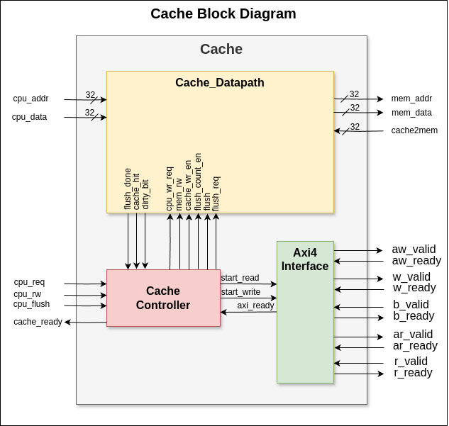
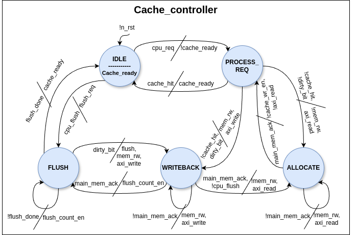
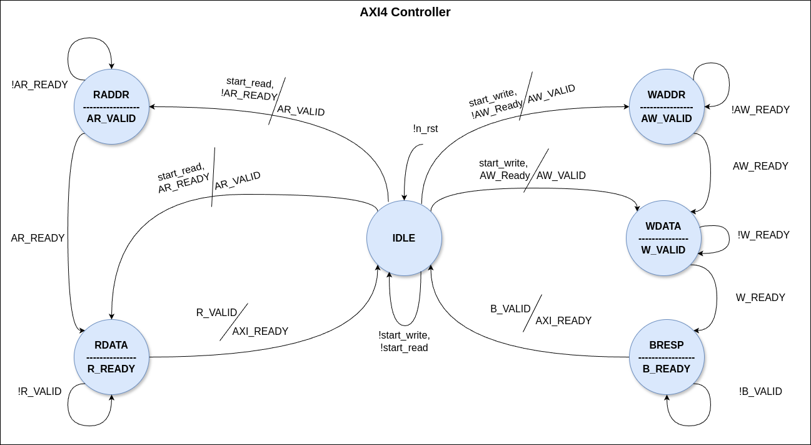

# Cache Design README

## Overview

This repository contains a cache design implemented in System Verilog. The design is intended to be simulated and tested using Vivado and ModelSim.

## Design Images

Below are images of the cache design to help visualize its components and structure:

*Figure 1: Top Module Diagram*

*Figure 2: Cache Controller Diagram*

*Figure 2: AXI4-lite Controller Diagram*

## Simulation

### Vivado Simulation

To simulate the cache design using Vivado, follow these steps:

1. Open Vivado and create a new project.
2. Add the system verilog files from this repository to the project.
3. Set the top-level entity to **[cache]**.
4. Run the simulation using the `make vivado` command.

### ModelSim Simulation

To simulate the cache design using ModelSim, follow these steps:

1. Open ModelSim and create a new project.
2. Add the VHDL files from this repository to the project.
3. Set the top-level entity to **[cache]**.
4. Run the simulation using the `make vsim` command.

### Viewing Waveforms

To view the simulation results using Vivado's waveform viewer, use the `make viv_waves` command. This will open the waveform viewer and display the simulation results.

## Cleaning Up

To clean up the simulation files and directories, use the `make clean` command. This will remove all simulation files and directories.

## Makefile Targets

The following targets are available in the Makefile:

- `vivado`: Run a Vivado simulation.
- `viv_waves`: View the simulation results using Vivado's waveform viewer.
- `vsim`: Run a ModelSim simulation.
- `clean`: Clean up the simulation files and directories.

## Prerequisites

- Vivado and ModelSim must be installed on your system.
- The `xsim`, `xelab`, and `vsim` commands must be in your system's PATH.

