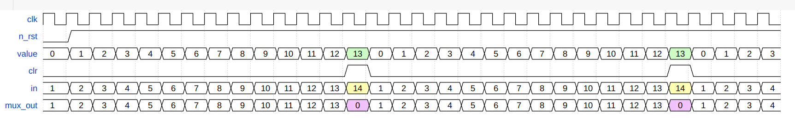

# 4-bit Counter (Counts up to 13)

## Overview

This project implements a 4-bit counter that counts from 0 to 13. After reaching 13, the counter resets back to 0 and starts counting again. This counter can be used in various digital applications where counting and timing functionalities are required.

## Dependencies
- Xilinx Vivado Design Suite
- Make

## Features

- 4-bit counter
- Counts from 0 to 13
- Resets to 0 after reaching 13
- Simple design and easy to integrate

## Design Details

### Counter Logic

The counter is designed using basic digital logic components. It includes:

- **Register**: To store the current count value.
- **Combinational Logic**: To implement the counting logic and reset mechanism.

### Diagram

The diagram for the counter is as follows:


## Usage

### Running Simulation
To run the simulation:
1. Ensure that Vivado is installed and properly set up on your system.
2. Navigate to the project directory.
3. Run the following command:
   ```sh
   make

### Waves GUI
To run the waves in gui mode, you have to run the following command:
   ```sh
   make viv_waves
```
### Wave Sample
The wave for the counter is as follows:

