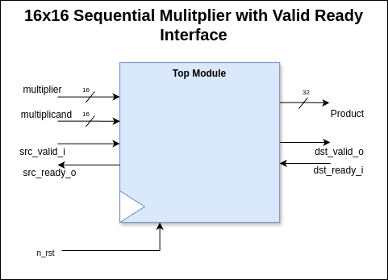
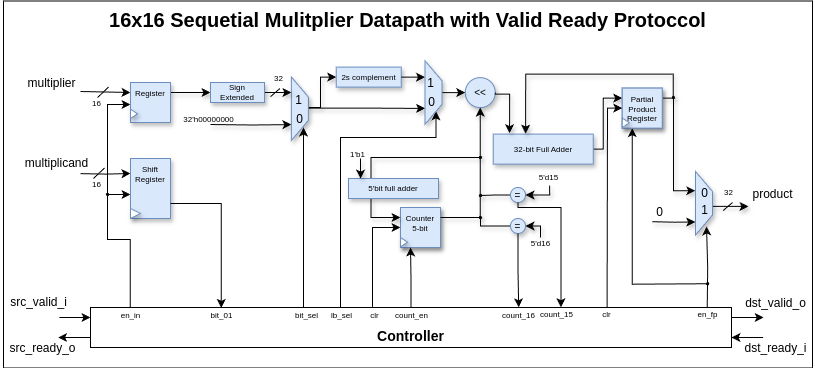
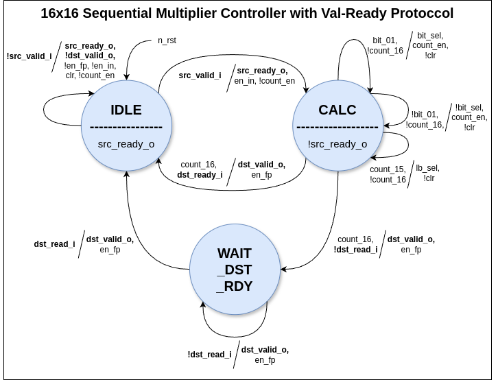

# 16-bit Signed Sequential Multiplier with Ready Valid Interface

## Overview

This project involves the design and implementation of a sequential multiplier with the valid ready interface. A sequential multiplier is a digital circuit that multiplies two binary numbers in a sequential manner, producing the result within 17-18 clock cycles. This type of multiplier is generally simpler and requires less hardware compared to parallel multipliers, but it takes more clock cycles to produce the result.

## Project Structure

- **src/**: This directory contains the source code for the sequential multiplier.
- **test/**: This directory contains the testbenches and other files required for testing the sequential multiplier.
- **docs/**: This directory contains the design of the top-module, datapath and controller.
- **log/**: This directory contains the output_result file after running the simulation.

## Features

- **Sequential Operation**: The multiplier performs multiplication in a sequence of steps, making it efficient in terms of hardware utilization.
- **Valid-Ready Interface**: The design includes valid ready signals to control the operation of the multiplier.

## Design Details

Following is the Top Module of the Sequential Multiplier:



The sequential multiplier is designed using a state machine that controls the multiplication process. The primary components include:

1. **Multiplicand Register**: Stores the multiplicand value.
2. **Multiplier Shift Register**: Stores the multiplier value.
3. **Partial Product Register**: Stores the intermediate and final product values.
4. **Control Unit**: Manages the states and operations of the multiplier.

The following is the Datapath of the sequential multiplier:




### States of the Control Unit

1. **IDLE**: Waiting for the src_valid signal. (src_ready signal is always asserted in this state) 
2. **CALC**: Performing the multiplication over multiple clock cycles.
3. **WAIT_DST_RDY**: Holding the output until the destination ready signal is asserted.

The following is the Controller of the sequential multiplier:



## Getting Started

### Prerequisites

To work with this project, you will need the following tools:

- **Model Sim**: For simulating the design.
- **Makefile**: To run the simulation.

### Installation

1. Clone the repository:

   ```bash
   git clone git@github.com:Fazail333/Xcelerium-IC-Design-Training.git
   cd ./Fazail/assignments/rdy_val_sequential_multiplier
   ```

2. Set up your simulation environment as per the requirements of your simulator tool.

### Running Simulations

1. Run the sequential multiplier simulation:

   ```bash
   make run
   ```

2. Run the wave form of the simulation:

   ```bash
   make simulate

