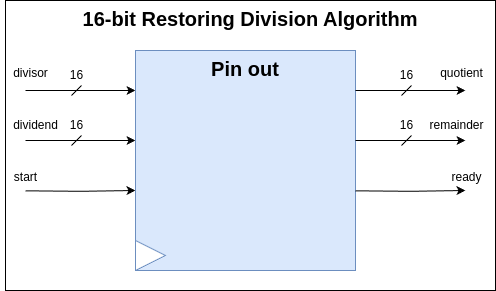
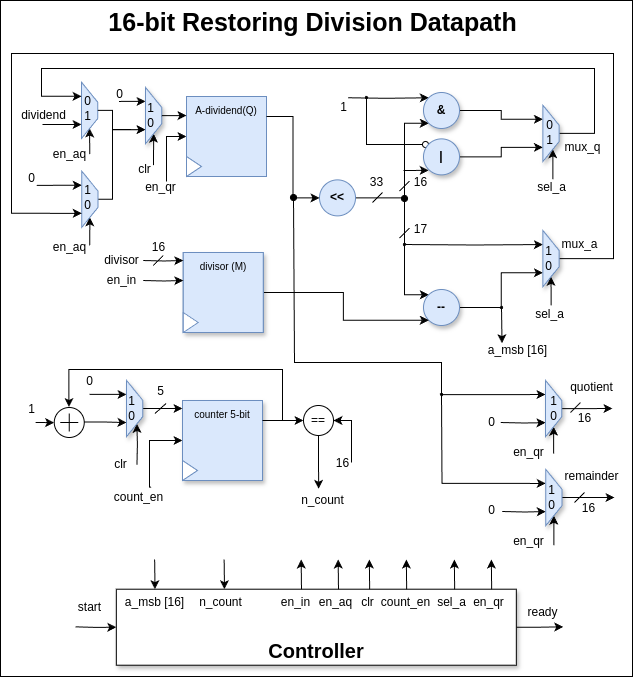
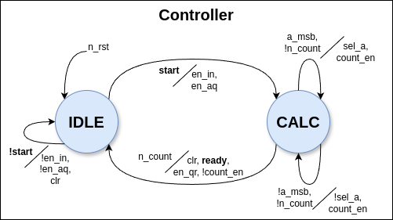

# Restoring Division Algorithm Hardware Design

## Overview
This repository contains a hardware design for the Restoring Division Algorithm implemented in Verilog. The restoring division algorithm is a classic digital algorithm used to perform integer division. This implementation is intended for educational purposes and demonstrates the principles of division in digital hardware.
   
## Design Details

Following is the Top Module of the Restoring Division Algorithm:



The Restoring Division Algorithm is designed using a state machine that controls the division process. The primary components include:

1. **Dividend Register**: Stores the dividend value.
2. **Divisor Register**: Stores the divisor values.
4. **Control Unit**: Manages the states and operations of the division.

The following is the Datapath :




### States of the Control Unit

1. **Idle**: Waiting for the start signal.
2. **Calc**: Performing the division over multiple clock cycles.

The following is the Controller :



## Simulation
The design is simulated using the following tools:

- **CoCotb**: A testing framework for hardware designs.
- **Icarus Verilog**: A Verilog simulation and synthesis tool.
- **Verilator**: A high-performance Verilog simulator.
- **Vivado**: Xilinx's FPGA design suite.
- **ModelSim**: A popular simulation tool for FPGA and ASIC designs.

## Getting Started

1. **Setup the Environment**

   Ensure that you have the required tools installed:
   - CoCotb
   - Icarus Verilog
   - Verilator
   - Vivado
   - ModelSim
   
2. **Run Simulations**

   Depending on the tool you choose, follow the respective instructions:
   - **Icarus Verilog**: Use the provided scripts or commands to compile and run the simulation.
   - **Verilator**: Use the provided scripts or commands to compile and run the simulation.
   - **Vivado**: Open the project in Vivado and run the simulation.
   - **ModelSim**: Open the project in ModelSim and run the simulation.
   
3. **Testing**

   Tests are provided using CoCotb. Ensure CoCotb is correctly set up and run the tests to verify the functionality of the design.

### Installation

1. Clone the repository:

   ```bash
   git clone <repository-url>
   cd restoring_division_algorithm
   ```

2. Set up your simulation environment as per the requirements of your simulator tool.

### Running Simulations

1. Run the simulation:

   ```bash
   make verilator
   ```

2. Run the wave form of the simulation:

   ```bash
   make ver_waves
   
### Running Cocotb

1. Run the simulation:

   ```bash
   make cocotb
   ```

2. Run the wave form of the simulation:

   ```bash
   make coco_wave
