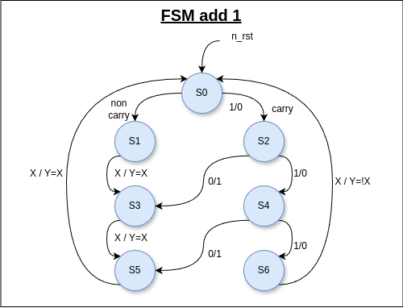
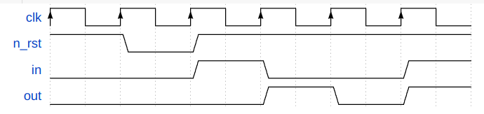

# 4-bit Sequential 1-Adder

## Overview

This project implements a sequential 4-bit adder that adds 1 to a 4-bit binary number. The adder uses sequential logic to perform the addition operation, and can be used in various digital applications where simple arithmetic operations are required.

## Features

- 4-bit adder
- Adds 1 to the current 4-bit input value
- Simple and easy to integrate

## Design Details

### State Diagram

The state diagram for the adder is as follows:



## Usage

### Running Simulation
To run the simulation:
1. Ensure that Modelsim is installed and properly set up on your system.
2. Navigate to the project directory.
3. Run the following command:
   ```sh
   make

### Waves GUI
To run the waves in modelsim gui mode, you have to run the following command:
   ```sh
   make vsim
```
### Waveform sample

The waveform of the design is as follows:




