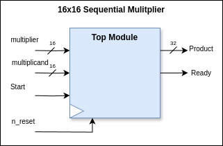
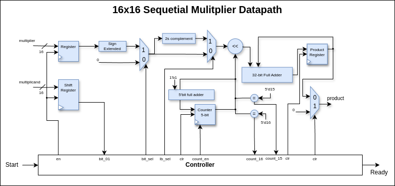
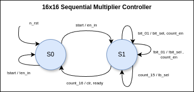

# 16-bit Signed Sequential Multiplier Project

## Overview

This project involves the design and implementation of a sequential multiplier. A sequential multiplier is a digital circuit that multiplies two binary numbers in a sequential manner, producing the result within 17-18 clock cycles. This type of multiplier is generally simpler and requires less hardware compared to parallel multipliers, but it takes more clock cycles to produce the result.

## Project Structure

- **src/**: This directory contains the source code for the sequential multiplier.
- **test/**: This directory contains the testbenches and other files required for testing the sequential multiplier.
- **docs/**: This directory contains the design of the top-module, datapath and controller.
- **log/**: This directory contains the output_result file after running the simulation.

## Features

- **Sequential Operation**: The multiplier performs multiplication in a sequence of steps, making it efficient in terms of hardware utilization.
- **Configurable Bit-width**: The bit-width of the multiplicand and multiplier can be configured as per requirements but you must have to change its shift register.
- **Start and Ready Signals**: The design includes start and ready signals to control the operation of the multiplier.

## Design Details

Following is the Top Module of the Sequential Multiplier:



The sequential multiplier is designed using a state machine that controls the multiplication process. The primary components include:

1. **Multiplicand Register**: Stores the multiplicand value.
2. **Multiplier Shift Register**: Stores the multiplier value.
3. **Partial Product Register**: Stores the intermediate and final product values.
4. **Control Unit**: Manages the states and operations of the multiplier.

The following is the Datapath of the sequential multiplier:




### States of the Control Unit

1. **Idle**: Waiting for the start signal.
2. **Calc**: Performing the multiplication over multiple clock cycles.

The following is the Controller of the sequential multiplier:



## Getting Started

### Prerequisites

To work with this project, you will need the following tools:

- **Model Sim**: For simulating the design.
- **Verilator**: For simulating the design.
- **Cocotb**: For simulating the design
- **Makefile**: To run the simulation.

### Installation

1. Clone the repository:

   ```bash
   git clone <repository-url>
   cd sequential-multiplier
   ```

2. Set up your simulation environment as per the requirements of your simulator tool.

### Running Simulations

1. Run the sequential multiplier simulation:

   ```bash
   make verilator
   ```

2. Run the wave form of the simulation:

   ```bash
   make ver_waves
   
### Run Cocotb

1. Run the sequential multiplier simulation:

   ```bash
   make cocotb
   ```

2. Run the wave form of the simulation:

   ```bash
   make coco_wave
   
## Gate Counts

### Combinational Multiplier

| ITEMS          | Total no.   | Gates   |
|----------------|-------------|---------|
| Full Adders    | 225         | 1125    |
| Half Adders    | 16          | 32      |
| AND / NAND     | 226 / 30    | 256     |
|                | Total GATES | 1413    |

### Sequential Multiplier

| ITEMS          | Total no.   | Gates   |
|----------------|-------------|---------|
| Adders(32-bit) | 2           | 321     |
| Adder (5-bit)  | 1           | 25      |
| Muxes (2x1)    | 3           | 9       |
| Comparators (2)| 2           | 18      |
|                | Total GATES | 373     |
