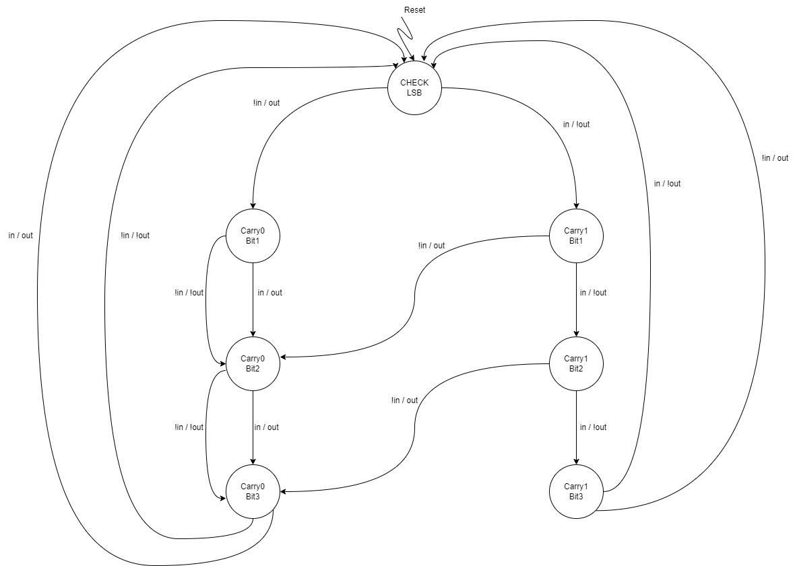

# Sequential Adder

## Description

The `sequential_adder` module is a SystemVerilog implementation of a simple sequential adder. This module sequentially adds 1 to a 4-bit input number by checking each bit, processing carries if necessary, and providing the result through an output signal.

## Diagrams

  
*Figure 1: STG Diagram*


## Module Details

- **Module Name:** `sequential_adder`
- **Inputs:**
  - `clk`: Clock signal for synchronous operations.
  - `reset`: Reset signal to initialize the state.
  - `num`: A 4-bit input number to which the sequential adder is applied.
- **Output:**
  - `out`: Output bit, representing the result of the processed bit addition.

## State Machine

The module uses a finite state machine (FSM) to process each bit of the input number:

1. **IDLE:** Initial state before any operation begins.
2. **CHECK_LSB:** State to check the least significant bit (LSB) of the input number.
3. **CARRY0_BIT1 to CARRY1_BIT3:** Intermediate states to handle carry and process each bit.

### State Transitions

- **IDLE:** 
  - Transitions to `CHECK_LSB` when starting the operation.

- **CHECK_LSB:** 
  - Checks the LSB of `num`.
  - If LSB is `1`, moves to `CARRY1_BIT1` with output `0`.
  - If LSB is `0`, moves to `CARRY0_BIT1` with output `1`.

- **CARRY0_BIT1:** 
  - Processes the second bit of `num`.
  - Transitions to `CARRY0_BIT2` with output based on the second bit value.

- **CARRY1_BIT1:** 
  - Similar to `CARRY0_BIT1`, but handles carry from the first bit.

- **CARRY0_BIT2:** 
  - Processes the third bit of `num`.
  - Transitions to `CARRY0_BIT3` with output based on the third bit value.

- **CARRY1_BIT2:** 
  - Similar to `CARRY0_BIT2`, but handles carry from the second bit.

- **CARRY0_BIT3:** 
  - Processes the fourth bit of `num`.
  - Returns to `CHECK_LSB` for the next input cycle.

- **CARRY1_BIT3:** 
  - Similar to `CARRY0_BIT3`, but handles carry from the third bit.

## Makefile

This project includes a Makefile to automate the simulation process using VSIM (ModelSim).

### Makefile Targets

- **help:** Displays help information about available targets.
- **sim:** Runs the simulation using the specified tool (VSIM).
- **clean:** Removes generated files and cleans up the directory.

### Usage

#### Running Simulation

To run the simulation using VSIM, use the following command:

```bash
make sim TOOL=vsim
```

### Cleaning Up

To remove generated files (compiled output and waveform files), run:

```bash
make clean
```
