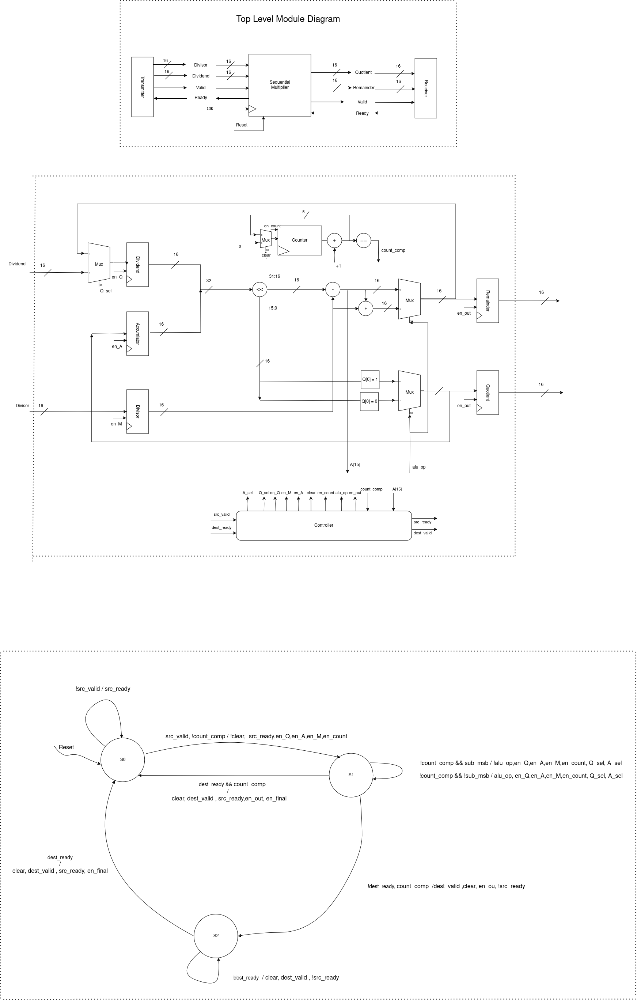

# Restoring Division with Handshake Protocol
This project implements a 16-bit restoring division algorithm using SystemVerilog.The divider takes 16 clock cycles to compute the quotient and remainder of two 16-bit unsigned integers.

## Directory Structure

- `docs/`: Contains top level diagram, datapath and controller images related to the Restoring Division project.
- `src/`: Contains System Verilog codes files for the Restoring Division.
- `test/`: Contains testbenches for verifying the functionality of the Restoring Division.

## Diagrams
  
*Figure 1: Restoring Division Diagram*

### Signals
- **Inputs to `controller`**:
  - **src_valid**: Indicates that the testbench has valid data available (multiplicand and multiplier).
  - **dest_ready**: Indicates that the testbench is ready to accept the result which is product in our case.

- **Outputs from `controller`**:
  - **src_ready**: Indicates that the multiplier is ready to get data from the testbench. It is not busy
  - **dest_valid**: Indicates that the multiplication result is valid and ready to be read by the testbench.

## How to use

### Compile
Compile the Verilog Code:
```
make 
```

### cleanup
```
make clean
```
