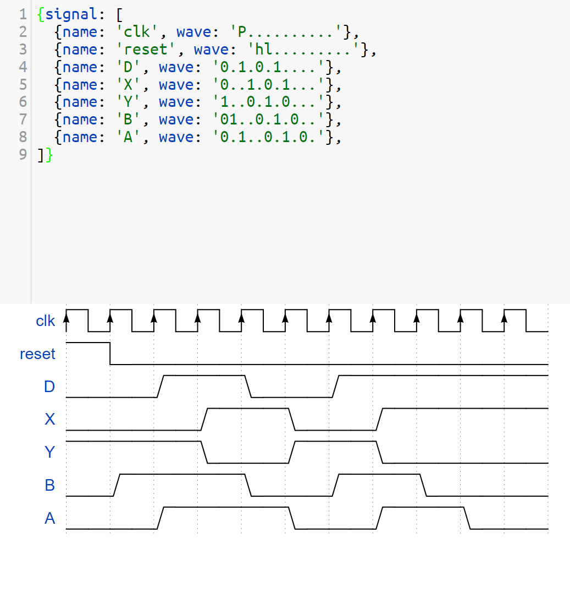

# Flip Flop Chain Module

## Description

The `flip_flop_chain` module is a SystemVerilog design that implements a chain of three flip-flops with asynchronous reset. The module also includes a combinational inverter between the first and second flip-flops.

## Waveform Documentation

For a visual representation of the `flip_flop_chain` module’s behavior, refer to the waveform diagrams located in the `docs` folder. These diagrams illustrate the signal transitions and the internal workings of the flip-flop chain during simulation.

## Diagrams

  
*Figure 1: Waveform Diagram*


### Waveform Files

- **Location:** `docs/`
- **Contents:** Includes waveform files and diagrams that show the operation of the flip-flop chain module.

## Makefile

This project includes a Makefile to automate the simulation process using VSIM (ModelSim).

### Makefile Targets

- **help:** Displays help information about available targets.
- **sim:** Runs the simulation using the specified tool (VSIM).
- **clean:** Removes generated files and cleans up the directory.

### Usage

#### Running Simulation

To run the simulation using VSIM, use the following command:

```bash
make sim TOOL=vsim
```

To run the simulation using Verilator, use the following command:

```bash
make sim TOOL=verilator
```


### Cleaning Up

To remove generated files (compiled output and waveform files), run:

```bash
make clean
```


