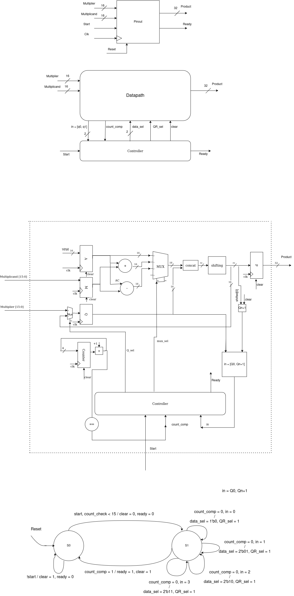

# Sequential Multiplier

## Overview

The Sequential Multiplier is a hardware implementation of Booth's multiplication algorithm, which is an efficient way to perform binary multiplication. This project includes Verilog source files for the Booth Multiplier, testbenches, and documentation.

## Diagrams

  
*Figure 1: Protocol Diagram*


## Directory Structure

- `docs/`: Contains documentation related to the Booth Multiplier project.
- `src/`: Contains Verilog source files for the Booth Multiplier and related modules.
- `test/`: Contains testbenches for verifying the functionality of the Booth Multiplier.

## Files

- `src/Controller.sv`: Verilog source file for the controller module.
- `src/Datapath.sv`: Verilog source file for the datapath module.
- `src/Multiplier.sv`: Verilog source file for the Booth Multiplier module.
- `test/Multiplier_tb.sv`: Verilog source file for the testbench of the Booth Multiplier.

## Simulation

To run simulations of the Booth Multiplier, you can use either `VSIM` or `iverilog`.

### Using VSIM

1. Ensure that your simulation tool `vsim` is installed.
2. Run the following command to compile and simulate using VSIM:

```bash
make sim TOOL=vsim
```

### Using Iverilog

1. Ensure that iverilog and vvp are installed.
2. Run the following command to compile and simulate using Iverilog:

```bash
make sim TOOL=iverilog
```

### Using Verilator

1. Ensure that Verilator is installed.
2. Run the following command to compile and simulate using Verilator:

```bash
make sim TOOL=verilator
```


### Cleaning Up

To remove generated files (compiled output and waveform files), run:

```bash
make clean
```
