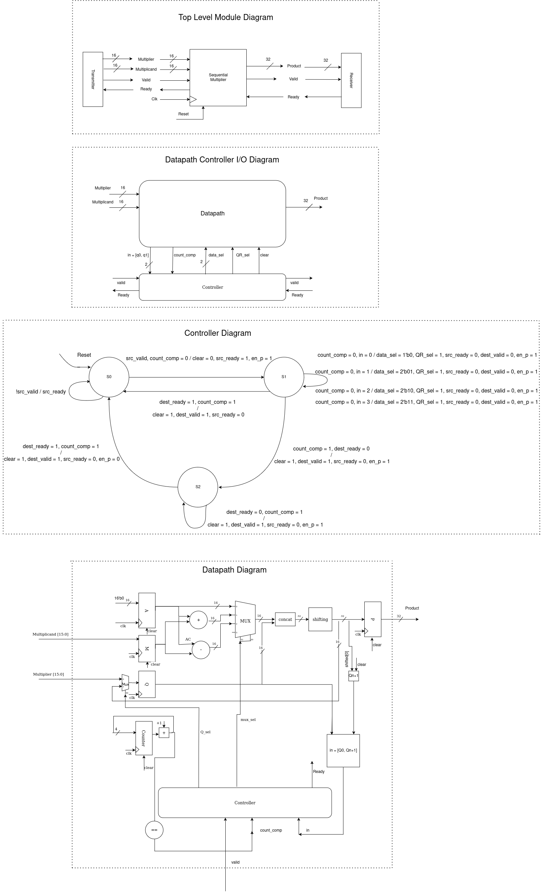

# Sequential Multiplier

## Overview

The Sequential Multiplier is a hardware implementation of Booth's multiplication algorithm with Val Ready Handshake Protocol, which is an efficient way to perform binary multiplication. This project includes Verilog source files for the Booth Multiplier, Val Ready Handshake Protocol, testbenches, and documentation.

## Diagrams

  
*Figure 1: Protocol Diagram*

## Directory Structure

- `docs/`: Contains documentation related to the Val Ready Handshake Protocol.
- `src/`: Contains Verilog source files for the Sequential Multiplier and Val Ready Handshake Protocol and related modules.
- `test/`: Contains testbenches for verifying the functionality of the Sequential Multiplier and Val Ready Handshake Protocol.

## Files

- `src/Controller.sv`: Verilog source file for the controller module.
- `src/Datapath.sv`: Verilog source file for the datapath module.
- `src/Multiplier.sv`: Verilog source file for the Booth Multiplier module.
- `test/Multiplier_tb.sv`: Verilog source file for the testbench of the Booth Multiplier.

## Simulation

To run simulations of the Booth Multiplier, you can use either `VSIM` or `iverilog`.

### Using VSIM

1. Ensure that your simulation tool `vsim` is installed.
2. Run the following command to compile and simulate using VSIM:

```bash
make sim TOOL=vsim
```

### Using Iverilog

1. Ensure that iverilog and vvp are installed.
2. Run the following command to compile and simulate using Iverilog:

```bash
make sim TOOL=iverilog
```

### Using Verilator

1. Ensure that Verilator is installed.
2. Run the following command to compile and simulate using Verilator:

```bash
make sim TOOL=verilator
```


### Cleaning Up

To remove generated files (compiled output and waveform files), run:

```bash
make clean
```
