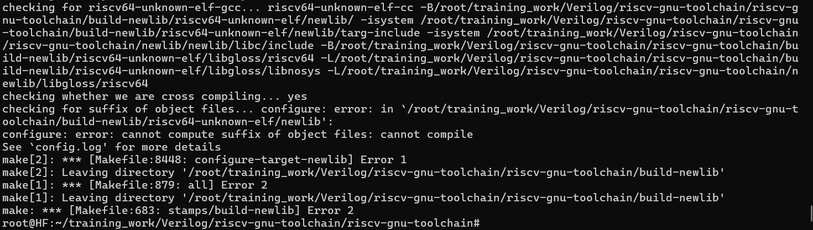

# Setting the toolchain:
### Clone Toolchain
    First clone the repo toolchain:
```bash
git clone https://github.com/riscv/riscv-gnu-toolchain
cd riscv-gnu-toolchain
```

### Clone the Relevant Submodules:
While clonning the whole repo, mostly "binutils folder" seems to be empty. 
This command will clone the desire binutils folder in which changes are to be made.
```bash 
git submodule update --init --recursive

```

#### Note: 
or simply run this command:
`git clone --recurse-submodules https://github.com/riscv/riscv-gnu-toolchain.git`

# Build tool chain:
```bash 
mkdir /opt/riscv
./configure --prefix=/opt/riscv
make
```

# Implement Custom intruction:
Main Changings that have to be made is in two files:
- `riscv-gnu-toolchain/riscv-binutils/opcodes/riscv-opc.c`
- `riscv-gnu-toolchain/riscv-binutils/includes/opcodes/riscv-opc.h`

# Requirements:
 An instruction: 
 `rev rd, r1`

 where rev is the reverse command, which will reverse the bits of value stored in r1 and will save the 
 reversed bit answer in rd

 ## Committed changes:
### riscv-opc.h file:
MATCH: This value contains the opcode and function fields that identify the REV instruction. 
(number 33 came from riscv-gnu-toolchain/riscv-binutils/gas/config/tc-riscv.c specifically from opcode_name_t opcode_name_list[]
where all the opcodes are defines and only reason i have defined the "OP"(if i am not wrong-> operation))
and 2 at the starts(func7 field) is ensuring its unique opcode value.

MASK: This value defines the bits that are fixed (i.e., the opcode and function bits) for the instruction.
As the desire instruction is assumed to be an 'R-TYPE' instruction. Thats why thsi specific number is used
```bash
define MATCH_REV 0x20000033
define  MASK_REV  0xfe00707f
```
### riscv-opc.c file
The riscv-opc.c file holds the structure of the command which has to be integrated:

For the required instruction:
`{"rev",         0, INSN_CLASS_I, "d,t",       MATCH_REV, MASK_REV|MASK_RS1, match_opcode, INSN_ALIAS },`

for the desire instruction is assumed to be a 'R-TYPE' intruction and the structure of 
`func7 | rs2 | rs1 | func3 | rd | opcode`
and as quoted in reqirements we only need two operants thats where this "MASK_REV|MASK_RS1" is comming from. 

# Build again:
After committing the desire changings we have to re build the toolchain again.
```bash
make clean
```
# Possilbe errors
and run the above commands again
 ## Note: 
 On building if you get an error of "new lib" as shown below, there is a mistake in your defined mask or match value.
 revisit it again or try rebuilding toolchain again.
 


And if you get this error shown below this is surely because of the MASK you have defined try changing it.

- one solution can be changing it to all "0xffff". but thats not the permanent solution.

more details are given here https://github.com/riscv-software-src/riscv-tools/issues/233

# Generate respective Dump file:
To generate the assembly file using riscv-toolchain of a C program is as followed:
to generate elf file
`riscv64-unknown-elf-gcc -o practice.elf practice.c`

To generate dump file
`riscv64-unknown-elf-objdump -d practice.elf > practice.dump`

