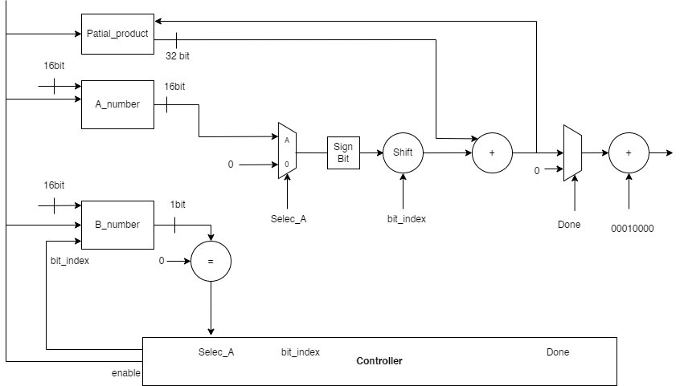
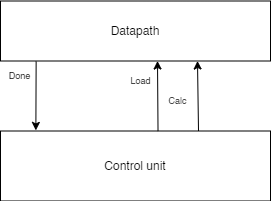
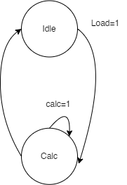

# Sequential Multiplier Project

## Overview

This project implements a 16-bit Sequential Multiplier in SystemVerilog, designed to efficiently multiply two 16-bit signed numbers using a control unit and a datapath module.

## Diagrams

- **Block Diagram**: 
- **Flow Diagram**: 
- **State Diagram**: 

## Project Structure

### Source Files

- `Control.sv`: Contains the control unit.
- `Top_module.sv`: Top-level module that instantiates the datapath and control unit.
- `sequential_multiplier.sv`: Contains the datapath module.

### Makefile

- **Compile the project**: `make compile`
- **Simulate the project**: `make simulate`
- **Debug using GTKWave**: `make debug`
- **Clean up generated files**: `make clean`

## Modules

### Control Unit (`control_unit`)

Handles state transitions and control signals.

### Datapath (`datapath`)

Performs the multiplication operation.

### Top Module (`top_multiplier`)

Instantiates the control unit and datapath, connecting them together.

## Test Bench (`tb_top_multiplier`)

Verifies the functionality through random and directed test cases.

## Running the Project

1. **Compile the project**:
   ```sh
   make compile
