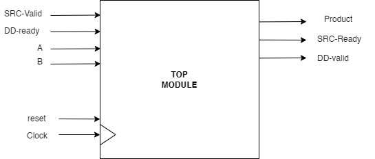
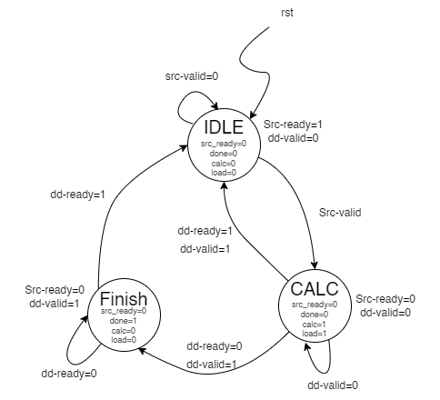

# MULTIPLIER TEST BENCH

## Valid-Ready Protocol

The valid-ready protocol is a handshake mechanism commonly used in digital design to manage data transfer between components. It ensures that data is only transmitted when both the sender is ready to send (valid) and the receiver is ready to receive (ready). This protocol helps to coordinate data flow, avoiding data loss and ensuring synchronization between different modules.

## Implementation

This test bench verifies a multiplier module using the valid-ready protocol. The following functionalities are included:

- **Random Testing:** Generates a specified number of random test cases to verify the multiplier.
- **Driver for Directed Test Cases:** Allows specific input values to be tested for the multiplier.
- **Monitor:** Observes and checks the output of the multiplier against expected results.

The test bench uses a state transition diagram to model the valid-ready protocol. The state transition diagram, `sequential_multiplier_val_ready_diagram.png`, illustrates the states and transitions for the multiplier under the valid-ready protocol.

- **Top Level Diagram**: 
- **State Transition Diagram**: 

### Control Unit Module

The control unit module manages the state transitions of the multiplier. It handles the start, load, and calculation states, ensuring proper data flow and processing according to the valid-ready protocol.

## Usage

To run the test bench, use the provided `Makefile`. The `Makefile` automates the compilation and simulation process, ensuring that all necessary files are correctly handled.

```sh
make run
