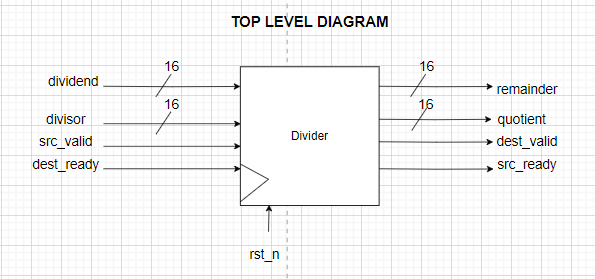
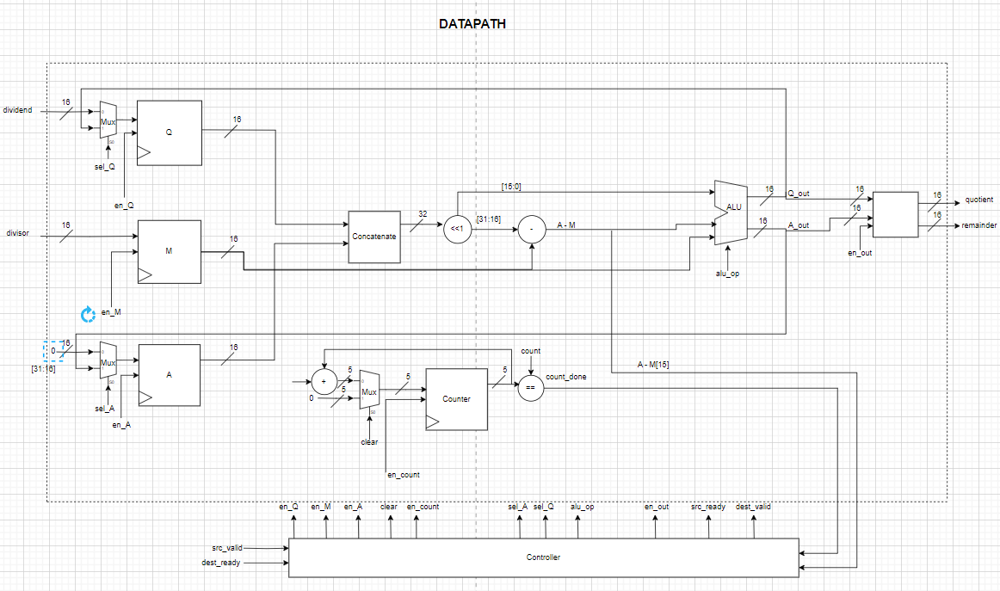
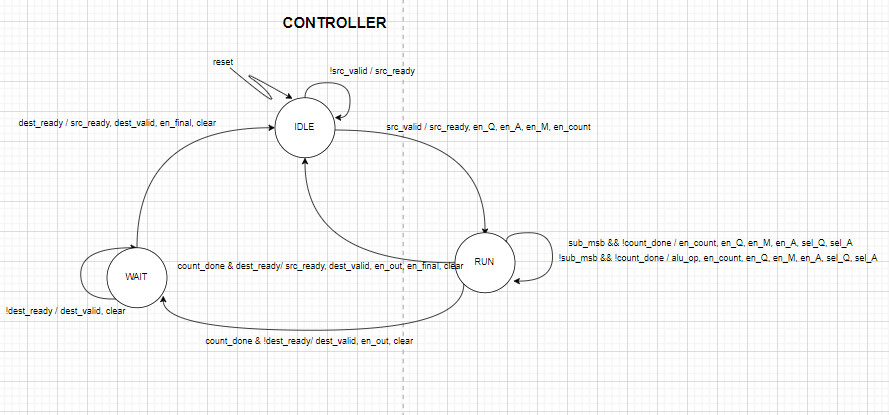
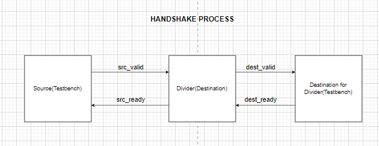

# Restoring Division with Handshake Protocol

This project implements a 16-bit restoring division algorithm using SystemVerilog. The design incorporates a valid-ready handshake protocol for data transfer between a testbench and the divider. The divider computes the quotient and remainder of two 16-bit unsigned integers over 16 clock cycles. This project  has a Cocotb testbench for the verification of the divider.

## Table of Contents
1. [Project Structure](#project-structure)
2. [Top Level Diagram](#top-level-diagram)
3. [Module Descriptions](#module-descriptions)
4. [Handshake Protocol](#handshake-protocol)
5. [Cocotb Testbench](#cocotb-testbench)
6. [Simulation Makefile](#simulation-makefile)

    - [Targets](#targets)
    - [Requirements](#requirements)
    - [Usage](#usage)
## Project Structure
The project contains the following files:

- `src/ALU.sv`: Implements the arithmetic operations of the restoring divider.
- `src/Register.sv`: Implements the register operations of the restoring divider.
- `src/Mux.sv`: Implements the multiplexer operations of the restoring divider.
- `src/Datapath.sv`: Implements the datapath of the restoring divider.
- `src/Controller.sv`: Implements the controller of the restoring divider.
- `src/restoring_division.sv`: Top-level module integrating the datapath and controller.
- `test/tb_restoring_division.sv`: Testbench for the restoring divider. Only includes the initialization and vcd file generation.
- `test/tb_restoring_division.py`: The testbench written in python using Cocotb. 

## Top Level Diagram



## Module Descriptions
### `restoring_division.sv`
The top-level module `restoring_division` is parameterized with a default width of 16 bits. It has the following ports:

- **Inputs:**
  - `clk`: Clock signal.
  - `rst_n`: Active-low reset signal.
  - `src_valid`: Start signal from the source.
  - `dest_ready`: Ready signal from the second destination to which the result will be delivered.
  - `dividend`: 16-bit unsigned dividend input.
  - `divisor`: 16-bit unsigned divisor input.
- **Outputs:**
  - `quotient`: 16-bit unsigned quotient output.
  - `remainder`: 16-bit unsigned remainder output.
  - `src_ready`: Ready signal indicating that the divider is ready to accept new values.
  - `dest_valid`: Valid signal indicating that the result is ready.

The module integrates the Controller and Datapath modules, handling control logic and division operations.

### `Datapath.sv`



The `Datapath` module manages arithmetic operations for division, including partial remainder accumulation, shifting, and subtraction, guided by control signals from the controller.

### `Controller.sv`



The `Controller` module handles state transitions and generates control signals for the datapath. It manages the sequencing of operations and the handshake protocol.

### `tb_restoring_division.py`
The `tb_restoring_division` module is the cocotb-based testbench for the restoring divider. It includes tasks for driving inputs, monitoring outputs, and generating a reset sequence to validate the design by comparing computed results with expected values.

## Handshake Protocol



The valid-ready handshake protocol facilitates communication between the testbench (acting as the source) and the divider (acting as the destination), and then to another destination (the testbench again). The protocol ensures data transfer occurs only when both source and destination are ready. The signals used include:

- **Source to Destination:**
  - `src_valid`: Indicates that the source has valid data.
  - `src_ready`: Indicates that the destination is ready to accept data.

- **Destination to Next Destination:**
  - `dest_valid`: Indicates that the destination has valid data.
  - `dest_ready`: Indicates that the next destination is ready to accept data.


## Cocotb Testbench

The project includes a cocotb-based testbench to validate the restoring divider. The testbench is located in `test/tb_restoring_division.py` and uses cocotb for simulation.

### Testbench Description
- **Clock Generation**: Generates a clock signal for the DUT.
- **Reset Sequence**: Initializes values and applies reset.
- **Drive Inputs**: Drives input values to the DUT.
- **Monitor Outputs**: Monitors and verifies the outputs against expected values.
- **Random Delay**: Introduces random delays between tests.
- **Pass Inputs**: Executes test cases and validates results.

## Simulation Makefile

The Makefile supports both Icarus Verilog and Verilator for simulation. You can specify the simulation tool using the `TOOL` variable.

### Targets

- **`make TOOL=icarus`**: Compile and run the simulation using Icarus Verilog.
- **`make TOOL=verilator`**: Compile and run the simulation using Verilator.
- **`make view`**: Open the waveform file with GTKWave.

### Requirements

- **Icarus Verilog** or **Verilator**: For compiling and running simulations.
- **GTKWave**: For viewing waveform files.
- **Cocotb**: For running the Cocotb testbench.

### Usage
Navigate to the test directory containing the Makefile
```bash
cd test
```
1. **Compile and simulate with Icarus Verilog:**
   ```bash
   make TOOL=icarus
   ```
2. **Compile and simulate with Verilator:**
    ```bash
    make TOOL=verilator
    ```
3. **View the waveform:**
    ```bash
    make view
    ```