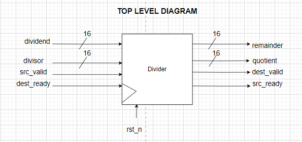
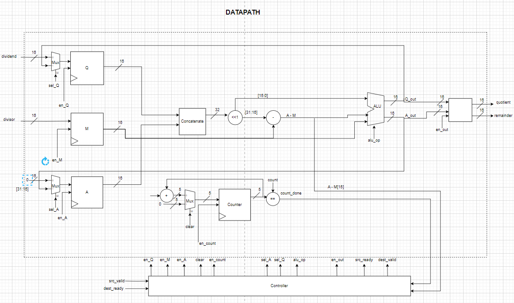
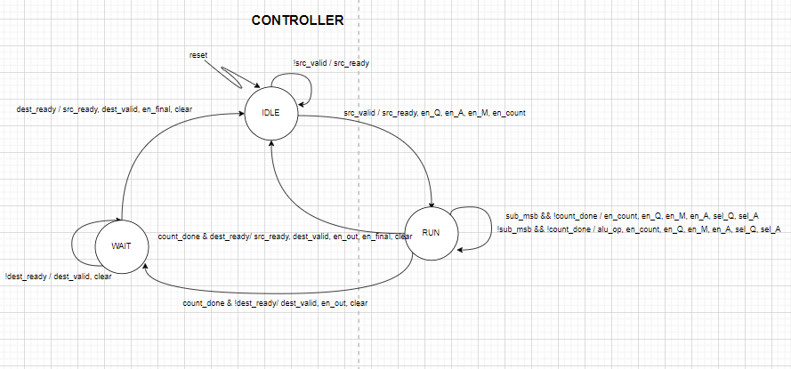
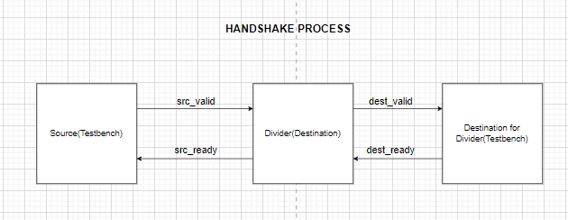

# Restoring Division with Handshake Protocol
This project implements a 16-bit restoring division algorithm using SystemVerilog. The design incorporates a valid-ready handshake protocol for data transfer between a testbench and the divider. The divider takes 16 clock cycles to compute the quotient and remainder of two 16-bit unsigned integers.

## Table of Contents
1. [Project Structure](#project-structure)
2. [Top Level Diagram](#top-level-diagram)
3. [Module Descriptions](#module-descriptions)
4. [Handshake Protocol](#handshake-protocol)
5. [Example Output](#example-output)
6. [Simualtion Makefile](#simulation-makefile)

    - [Targets](#targets)
    - [Requirements](#requirements)
    - [Usage](#usage)

## Project Structure
The project contains the following files:

- `src/ALU.sv`: Implements the arithmetic operations of the restoring divider.
- `src/Register.sv`: Implements the register operations of the restoring divider.
- `src/Mux.sv`: Implements the multiplexer operations of the restoring divider.
- `src/Datapath.sv`: Implements the datapath of the restoring divider.
- `src/Controller.sv`: Implements the controller of the restoring divider.
- `src/restoring_division.sv`: Top-level module integrating the datapath and controller.
- `test/tb_restoring_division.sv`: Testbench for the restoring divider.
## Top Level Diagram


## Module Descriptions
### `restoring_division.sv`
The top-level module restoring_division is parameterized with a default width of 16 bits. It has the following ports:

- **Inputs:**
    - `clk`: Clock signal.
    - `rst_n`: Active-low reset signal.
    - `src_valid`: Start signal from the source.
    - `dest_ready`: Ready signal from the second destination to which the result will be delivered.
    - `dividend`: 16-bit unsigned dividend input.
    - `divisor`: 16-bit unsigned divisor input.
- **Outputs:**
    - `quotient`: 16-bit unsigned quotient output.
    - `remainder`: 16-bit unsigned remainder output.
    - `src_ready`: Ready signal indicating that the divider is ready to accept new values.
    - `dest_valid`: Valid signal indicating that the result is ready.

The module includes instances of the Controller and Datapath modules, which handle the control logic and the actual division operations, respectively.

### `Datapath.sv`



The `Datapath` module manages the arithmetic operations required for division. It includes internal registers and logic for partial remainder accumulation, shifting, and subtraction. The control signals from the controller dictate the operations performed by the datapath.

### `Controller.sv`



The `Controller` module handles state transitions and generates control signals for the datapath. It ensures proper sequencing of operations and manages the handshake protocol.

### `tb_restoring_division.sv`
The `tb_restoring_division` module is the testbench for the restoring divider. It includes tasks for driving inputs, monitoring outputs, and generating a reset sequence. The testbench validates the design by comparing the quotient and remainder computed by the divider with the expected results.

## Handshake Protocol



The valid-ready handshake protocol is used for communication between the testbench (acting as the source) and the divider (acting as the destination) and another destination which in this case is again testbench. The protocol ensures that data transfer occurs only when both the source and destination are ready. The following signals are used:

- **Source to Destination:**
  - `src_valid`: Indicates that the source has valid data.
  - `src_ready`: Indicates that the destination is ready to accept data.

- **Destination to Next Destination:**
  - `dest_valid`: Indicates that the destination has valid data.
  - `dest_ready`: Indicates that the next destination is ready to accept data.

The sequence of operations for the handshake is as follows:

1. The testbench asserts `src_valid` when it has valid inputs.
2. The divider asserts `src_ready` when it is ready to accept the inputs.
3. When both `src_valid` and `src_ready` are high, the inputs are transferred to the divider.
4. The divider starts the division process, which takes 16 clock cycles.
5. Once the result is ready, the divider asserts `dest_valid`.
6. The testbench asserts `dest_ready` to accept the result.
7. The result is transferred to the testbench, completing the handshake.
8. The divider deasserts `dest_valid` and asserts `src_ready` to indicate readiness for new inputs

## **Example Output**

.png)
.png)

- **Explanation**:

    - From the above waveform, we can visualize that when `src_valid` and `src_ready` both are 1 the **First Handshake** occurs.
    - The values of the dividend and divisor are loaded in the internal registers.
    - The quotient and remainder are calculated in 16 clock cycles and are stored temporarily in registers.
    - After the result is ready, the `dest_valid` signal is asserted by the controller.
    - The controller waits for the `dest_ready` signal to be asserted by the testbench.
    - When both `dest_ready` and `dest_valid` are 1 the **Second Handshake** occurs.
    - The result is given as output to the second destination which asserts `dest_ready`.
    - From the waveform, it can be verified that the divider is generating the same `quotient` and `remainder` as the `expected values`.
## Simulation Makefile
This Makefile provides targets for compiling and running simulations of SystemVerilog code using Icarus Verilog and ModelSim. It also includes a target for viewing waveform files with GTKWave.

### Targets
- **`make iverilog`**: Compiles and runs the simulation using Icarus Verilog.
- **`make vsim`**: Compiles and runs the simulation using ModelSim.
- **`make view`**: Opens the waveform file with GTKWave.
- **`make clean`**: Removes generated simulation files.
- **`make help`**: Displays this help message.

### Requirements
- Icarus Verilog
- ModelSim
- GTKWave

Ensure these tools are installed and available in your PATH.

## Usage

1. **Compile and simulate with Icarus Verilog:**
   ```bash
   make iverilog
   ```
2. **Compile and simulate with ModelSim:**
    ```bash
    make vsim
    ```
3. **View the waveform:**
    ```bash
    make view
    ```
4. **Clean up generated files:**
    ```bash
    make clean
    ```