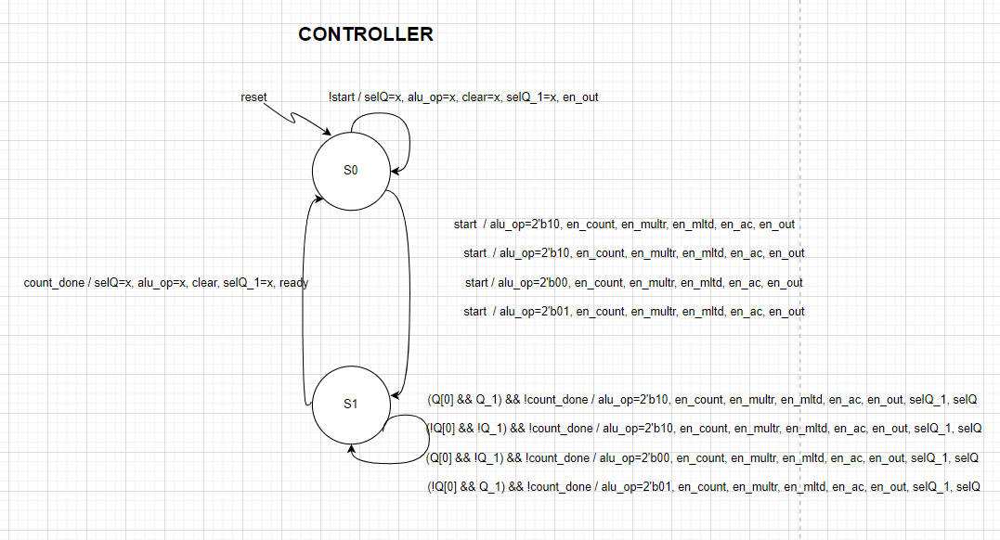
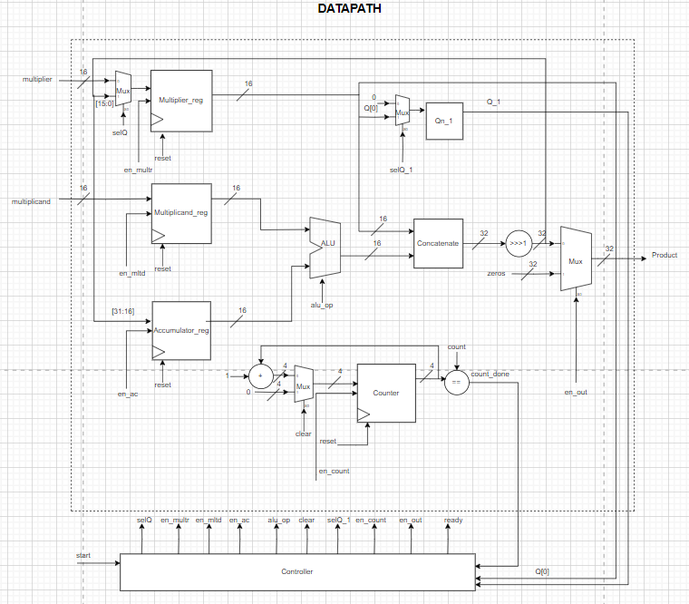

# Sequential Multiplier Project

This project implements a sequential multiplier using SystemVerilog, with separate modules for the Controller and Datapath. The multiplier is designed to handle 16-bit inputs and produce a 32-bit output. A corresponding testbench using cocotb in Python is also included for simulation and verification.

## Project Structure

The project contains the following files:

- `src/seq_multiplier.sv`: The top-level module that instantiates the Controller and Datapath.
- `src/Controller.sv`: The module that handles state transitions and control signals.
- `src/Datapath.sv`: The module that performs the multiplication operations and data flow.
- `src/Register.sv`: A parameterized register module used in the Datapath.
- `src/Mux.sv`: A parameterized multiplexer module used in the Datapath.
- `src/ALU.sv`: An ALU module used in the Datapath to perform arithmetic operations.
- `test/tb_seq_multiplier.sv`: The SystemVerilog testbench for the sequential multiplier.
- `test/tb_seq_multiplier.py`: The cocotb testbench for the sequential multiplier, written in Python.

## Top-Level Module

.png)

## Module Descriptions
### `seq_multiplier.sv`

This module connects the Controller and Datapath modules. It has the following ports:

- `clk`: Clock signal
- `rst_n`: Active-low reset signal
- `start`: Start signal
- `multiplier`: Multiplier input
- `multiplicand`: Multiplicand input
- `product`: Product output
- `ready`: Ready signal indicating the end of multiplication


### `Controller.sv`



This module manages the state transitions and control signals required for the multiplication process. It has inputs for the clock, reset, start signal, and status signals from the Datapath. It outputs control signals to the Datapath and a ready signal indicating the completion of the multiplication.


### `Datapath.sv`


This module performs the actual multiplication operations. It consists of registers for storing intermediate values, an ALU for arithmetic operations, and multiplexers for selecting inputs. The Datapath has inputs for control signals from the Controller and outputs status signals back to the Controller.

### `Register.sv`

A parameterized register module used in the Datapath to store values. It has inputs for clock, reset, and data, and an output for the stored value.

### `Mux.sv`

A parameterized multiplexer module used in the Datapath to select between different inputs. It has inputs for the selection signal and data inputs, and an output for the selected data.


### `ALU.sv`

An ALU module used in the Datapath to perform arithmetic operations such as addition and subtraction. It produces output based on `alu_op` signal from Controller.

## Testbench

### `tb_seq_multiplier.sv`

The SystemVerilog testbench for the sequential multiplier. It generates clock and reset signals, applies test vectors to the multiplier, and checks the outputs.

- The design module is instantiated here. 
- A vcd file is being generated to view the waveform. 

### `test_seq_multiplier.py`

The cocotb testbench for the sequential multiplier, written in Python. It uses the cocotb framework to drive inputs to the multiplier and verify the outputs. The testbench includes tasks for generating inputs, applying them to the multiplier, and checking the results.
 
## Makefile for Sequential Multiplier Project

This Makefile is used to compile and simulate the sequential multiplier project using Verilator and cocotb. The project includes various SystemVerilog source files and a testbench. This Makefile automates the build and simulation process.

## Variables

- `SIM`: Specifies the simulator to be used. Default is `verilator`.
- `TOPLEVEL_LANG`: Specifies the language of the top-level module. Default is `verilog`.

## Verilator Flags

- `--noassert`: Disables assertion checks.
- `--no-timing`: Disables timing checks.
- `-Wno-WIDTHEXPAND`: Suppresses width expansion warnings.

## Targets

### `all`

The default target, which depends on the `multiplier` target.

### `multiplier`

Cleans any previous build files, then compiles and runs the simulation. The following steps are performed:

1. Remove the `sim_build` directory if it exists.
2. Run the Makefile provided by cocotb with specified parameters:
   - `MODULE=tb_seq_multiplier`: Specifies the testbench module.
   - `TOPLEVEL=tb_seq_multiplier`: Specifies the top-level module.
   - `EXTRA_ARGS="$(VERILATOR_FLAGS)"`: Passes additional flags to Verilator.

### `view`

Opens the waveform file `multiplier_tb.vcd` using GTKWave for viewing simulation results.

## Usage
Navigate to test directory where makefile is located.
```bash
cd test
```
To compile and simulate the sequential multiplier project, run the following command:

```bash
make
```
