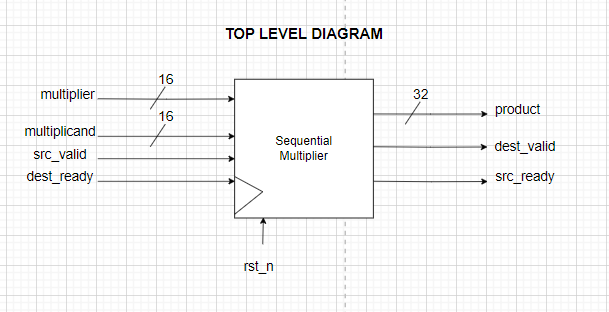
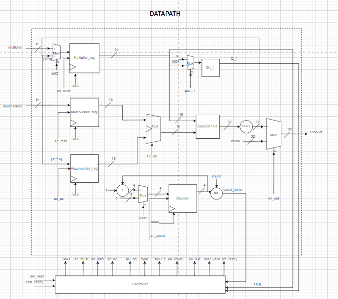
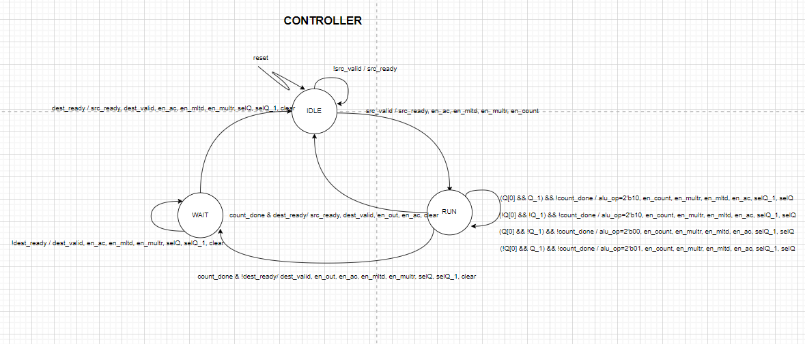
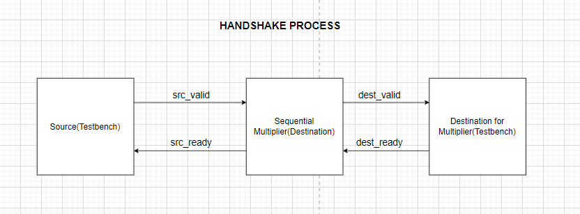

# Sequential Multiplier with Handshake Protocol

This project implements a 16-bit sequential multiplier using SystemVerilog. The design incorporates a valid-ready handshake protocol for data transfer between a testbench and the multiplier. The multiplier takes 16 clock cycles to compute the product of two 16-bit signed integers.

## Project Structure

The project contains the following files:

- `src/Datapth.sv`: Implements the datapath of the sequential multiplier.
- `src/Controller.sv`: Implements the controller of the sequential multiplier.
- `src/ALU.sv`: Implements the Arithmetic operations of the sequential multiplier.
- `src/Register.sv`: Implements the Register operation of the sequential multiplier.
- `src/Mux.sv`: Implements the mux operation of the sequential multiplier.
- `seq_multiplier.sv`: Top-level module integrating the datapath and controller.
- `tb_sequential_multiplier.sv`: Testbench for the sequential multiplier.

## Top Level Diagram


## Module Descriptions
### `seq_multiplier.sv`

The top-level module `seq_multiplier` is parameterized with a default width of 16 bits. It has the following ports:

- **Inputs:**
  - `clk`: Clock signal.
  - `rst_n`: Active-low reset signal.
  - `src_valid`: Start signal from the source.
  - `dest_ready`: Ready signal from the second destination to which product will be delivered.
  - `multiplier`: 16-bit signed multiplier input.
  - `multiplicand`: 16-bit signed multiplicand input.
  
- **Outputs:**
  - `product`: 32-bit signed product output.
  - `src_ready`: Ready signal indicating that multiplier is ready to accept new values.
  - `dest_valid`: Valid signal indicating that the product is ready.

The module includes instances of the `Controller` and `Datapath` modules, which handle the control logic and the actual multiplication operations, respectively.

### `Datapath.sv`



The `Datapath` module manages the arithmetic operations required for multiplication. It includes internal registers and logic for partial product accumulation, shifting, and addition. The control signals from the controller dictate the operations performed by the datapath.

### `Controller.sv`



The `Controller` module handles state transitions and generates control signals for the datapath. It ensures proper sequencing of operations and manages the handshake protocol.

### `tb_sequential_multiplier.sv`

The `tb_sequential_multiplier` module is the testbench for the sequential multiplier. It includes tasks for driving inputs, monitoring outputs, and generating a reset sequence. The testbench validates the design by comparing the product computed by the multiplier with the expected product.

## Handshake Protocol



The valid-ready handshake protocol is used for communication between the testbench (acting as the source) and the multiplier (acting as the destination) and another destination which in this case is again testbench. The protocol ensures that data transfer occurs only when both the source and destination are ready. The following signals are used:

- **Source to Destination:**
  - `src_valid`: Indicates that the source has valid data.
  - `src_ready`: Indicates that the destination is ready to accept data.

- **Destination to Next Destination:**
  - `dest_valid`: Indicates that the destination has valid data.
  - `dest_ready`: Indicates that the next destination is ready to accept data.

The sequence of operations for the handshake is as follows:

1. The testbench asserts `src_valid` when it has valid inputs.
2. The multiplier asserts `src_ready` when it is ready to accept the inputs.
3. When both `src_valid` and `src_ready` are high, the inputs are transferred to the multiplier.
4. The multiplier starts the multiplication process, which takes 16 clock cycles.
5. Once the product is ready, the multiplier asserts `dest_valid`.
6. The testbench asserts `dest_ready` to accept the product.
7. The product is transferred to the testbench, completing the handshake.
8. The multiplier deasserts `dest_valid` and asserts `src_ready` to indicate readiness for new inputs.

## **Example Output**

.png)
.png)
- **Explanation**
    
    - From the above waveform, we can visualize that when `src_valid` and `src_ready` both are 1 the **First Handshake** occurs.
    
    - The values of multiplier and multiplicand are loaded in multiplier_out and multiplicand_out registers respectively. 
    
    - The product is calculated in 16 clock cycles and is stored temporarily in register `product_given`.
    
    - After the product is ready in `product_given` register, `dest_valid` signal is asserted by the controller.
    
    - The Controller waits for the `dest_ready` signal to be asserted by the Testbench. 
    
    - When both `dest_ready` and `dest_valid` are 1 the **Second Handshake** occurs. 
    
    - The product at that moments is given as output `product` to the second destination which asserts `dest_ready`.
    
    - From the waveform it can be verified that the multiplier is generating the same `product` as `expected_product`

## Simulation Makefile

This Makefile provides targets for compiling and running simulations of SystemVerilog code using Icarus Verilog and ModelSim. It also includes a target for viewing waveform files with GTKWave.

### Targets

- **`make iverilog`**: Compiles and runs the simulation using Icarus Verilog.
- **`make vsim`**: Compiles and runs the simulation using ModelSim.
- **`make view`**: Opens the waveform file with GTKWave.
- **`make clean`**: Removes generated simulation files.
- **`make help`**: Displays this help message.

## Requirements

- Icarus Verilog
- ModelSim
- GTKWave

Ensure these tools are installed and available in your PATH.

## Usage

1. **Compile and simulate with Icarus Verilog:**
   ```bash
   make iverilog
   ```
2. **Compile and simulate with ModelSim:**
    ```bash
    make vsim
    ```
3. **View the waveform:**
    ```bash
    make view
    ```
4. **Clean up generated files:**
    ```bash
    make clean
    ```