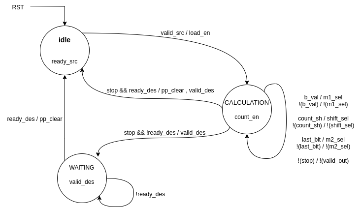

# 16x16 Sequential Signed Multiplier with Ready Valid hand-shake

## Introduction

16x16 bit sequential signed multiplier. 
A and B are signed inputs of 16 bits, product is 32-bits signed output. 
Finite State Machine(controller) has 2-bit register for  3 states which are **IDEL, CALCULATION** and **WAITING**. 
For valid output after the valid_in signal and ready_in signals goes to zero required 16 cycles for calculation product. After that valid_out come its maintain its condition and data until ready_out comes hihh and pick the data and goes to zero. 


## Usage: Automated for Multisim

Path to code: `Moazzam/src/systemverilog/seq_multiplier_valid_ready`

To execute the code and view the waveform on Multisim, simply use the following command:
```
make simulator
```

To execute the code on command line, simply use the following command:
```
make run
```

You can also decide the runtime for your code using the following command:
```
make run RUNTIME=xxxx
```
OR
```
make simulate RUNTIME=xxxx
```
**Note:** Where xxxx is the time in ps, you can give *RUNTIME=1000* --> which mean run for 1000ps

Once you've completely executed the code, don't forget to clean extra files through:
```
make clean
```

## Simulation with ready vaild hand-shake

### READY before VALID handshake
In the Simulation photo, **Hand-Shake 1** is shown this interface in which ready in already high and valid go high after some cycle and hand-shake after the clock cycle when both signal is high. 

### VALID before READY handshake
In the Simulation photo, **Hand-Shake-2** is shown this interface in which valid in already high and ready 
go high after some cycle and hand-shake after the clock cycle when both signal is high. 

### VALID with READY handshake
In the Simulation photo, **Hand-Shake-2** is shown this interface in which valid and ready 
go high at same cycle and hand-shake at that clock cycle when both signal is high. 

### Simulation photo


## Design Details

### Top Level Diagram


### Datapath


### Controller


## Gate Count
Total number of gates used in combinational logic

### Gate Count for Sequiential Multipler with Ready Valid
This Gate Count is with respect to 16-bits input and 32-bits output

| Module                  | Total Element | Gate Count |
| ----------------------- | -----------   | ---------- |
| 32'b Ripple Carry Adder | 1             | 160        |
| 5'b Ripple Carry Adder  | 1             | 25         |
| 32 bit 2's Compliment   | 1             | 161        |
| 32-bit 2x1 MUX          | 3             | 96         |
| 16-bit 2x1 MUX          | 1             | 48         |
| 5'b Equal Comparator    | 4             | 29         |


**Total Gate Count in Sequential Multiplier is: 794**
