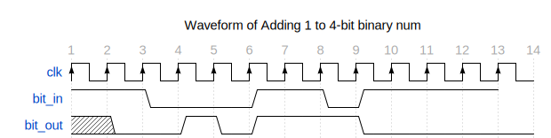

# Implementation of Sequential Binary Adder

This folder contains the files of system verilog implementation of sequential binary adder which adds 1 to every 4-bit binary number from the n-bit input stream. This functionality is verified by the test bench aimed to learn the sequential circuits concepts deeper.

# Overview of Algorithm

The problem is that we build the chip that takes one bit input and gives one bit output. The input stream is n-bit long. We have to add one in every 4-bit number in n-bit input stream. The algorithm that I use to add 1 to 4-bit number is the inverter logic such as

We observe that to add 1 to binary number, we only detect the first 0 in 4-bit sequence and then invert all previous bits included the 0 bit. In this way, we made the FSM using only four state as shown in the figure in `State Diagram` section.

## Problem 1: Sequential Binary Adder

- **File:** `seq_adder_inverter_logic.sv`
- **Description:** Build the chip of binary sequential adder that adds 1 to every 4-bit binary number. The circuit is basically the state machine or FSM having the diagram shown below. The hand written waveform (shown in the below figure) is verified by the waveform produced by simulator `vvp` that is visualized using the `gtkwave`. 

- **File:** `seq_adder_inverter_logic_tb.sv`
- **Description:** This file used to test the chip or verify its functionality.

# Run the script or verify the chip
To verify chip, you have to first download the compiler that compiles the system verilog source file e.g: iverilog. To visualize the signal, you have to download the gtkwave waveform visualizer.
- **To make all the builds files:** `make`
- **To run and make the `vcd` script:** `make run prog=<file_with_extension_.vvp>`
- **To clean all the builds:** `make clean`
- **To visualize the vcd file** `gtkwave <file_name_with_extension_.vcd>`

# State Diagram

# Results as Waveform Format

