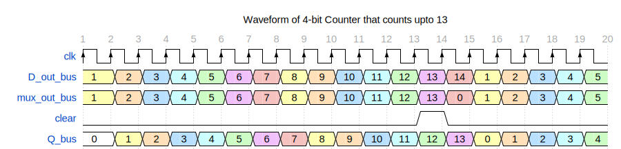

# Implementation of 4-bit Counter

This folder contains the files of system verilog implementation of counter and its test bench aimed to learn the sequential circuits concepts.

## Problem 1: 4-bit Counter Implementation

- **File:** `counter.sv`
- **Description:** Build the chip of n-bit counter that restarts when the value of the counter reached 13. The default circuit implemented is 4-bit counter having the hardware shown in the figure below. The hand written waveform (shown in the below figure) is verified by the waveform produced by simulator `vvp` that is visualized using the `gtkwave`. 

- **File:** `counter_tb.sv`
- **Description:** This file used to test the chip or verify its functionality.

# Run the script or verify the chip
To verify chip, you have to first download the compiler that compiles the system verilog source file e.g: iverilog. To visualize the signal, you have to download the gtkwave waveform visualizer.
- **To make all the builds files:** `make`
- **To run and make the `vcd` script:** `make run prog=<file_with_extension_.vvp>`
- **To clean all the builds:** `make clean`
- **To visualize the vcd file** `gtkwave <file_name_with_extension_.vcd>`

# Circuit Diagram

# Results as Waveform Format

