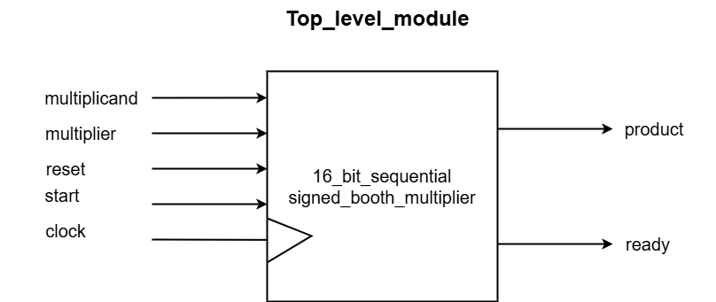

# Sequential Multiplier Project

## Table of Contents
- [Overview](#overview)
- [Top-Level Module](#top-level-module)
- [Datapath Module](#datapath-module)
- [Controller Module](#controller-module)
- [Sequential Multiplier Integration](#sequential-multiplier-integration)
- [State Transition Graph](#state-transition-graph)
- [Datapath Block Diagram](#datapath-block-diagram)
- [Usage](#Usage-Compilation-simulation)

## Overview
The Sequential Multiplier project implements a 16-bit multiplication using a sequential approach. It consists of two main components: the `Datapath` and the `Controller`. The `Datapath` handles arithmetic operations and data storage, while the `Controller` manages control signals and state transitions.

## Top-Level Module
The top-level module integrates the datapath and controller to form a functional 16-bit sequential Booth multiplier. This module receives inputs such as the multiplicand, multiplier, clock, reset, and start signals. It outputs the 32-bit product of the multiplication and a ready signal indicating the completion of the operation.



### Inputs:
- **Multiplicand (16-bit)**: The number to be multiplied.
- **Multiplier (16-bit)**: The number to multiply by.
- **Clock and Reset Signals**: Used for timing and initialization.
- **Start Signal**: Initiates the multiplication process.

### Outputs:
- **Ready Signal**: Indicates when the multiplication process is complete.
- **Product (32-bit)**: The result of the multiplication.


## Datapath Module
The `Datapath` module is responsible for performing arithmetic operations required for the multiplication process. It includes registers for the multiplicand, multiplier, accumulator, and control signals for multiplexers and counters.

### Key Components:
- **Multiplicand Register (BR)**: Stores the multiplicand.
- **Multiplier Register (QR)**: Stores the multiplier.
- **Accumulator Register (A)**: Stores the intermediate results.
- **Counter**: Keeps track of the number of operations performed.
- **Multiplexers (MUX)**: Select between different data inputs for arithmetic operations.
- **Arithmetic Logic**: Performs addition, subtraction, and right shift operations.

## Controller Module
The `Controller` module manages the state transitions and control signals based on the input and current state. It determines when to start, clear, or stop the multiplication process and which arithmetic operations to perform.

### State Machine:
- **IDLE State**: The initial state where the system waits for a start signal.
- **PROCESS State**: The active state where the multiplication process is carried out.

## Sequential Multiplier Integration
The `seq_multiplier` module integrates the `Datapath` and `Controller` modules. It orchestrates the overall multiplication process, coordinating between arithmetic operations and state transitions.

## State Transition Graph
The `Controller` module operates based on a state machine. The state transition graph outlines the possible states and transitions based on the control signals and conditions.


## Datapath Block Diagram
The `Datapath` block diagram illustrates the flow of data and control signals within the `Datapath` module. It shows the interactions between the registers, multiplexers, and arithmetic units.


## Usage

### Compile and Run

On terminal write below commands to compile and run sequential_multiplier using **iverilog**
```bash
    make 
    make all
    make run
```

### Simulation

On terminal write below command to see simulation of sequential_multiplier on **gtkwave**
```bash
    make vsim
```


