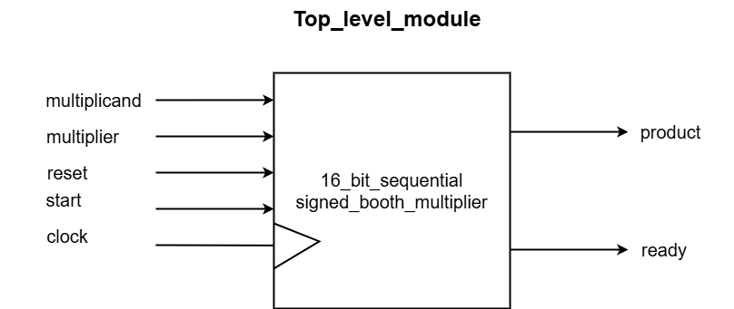
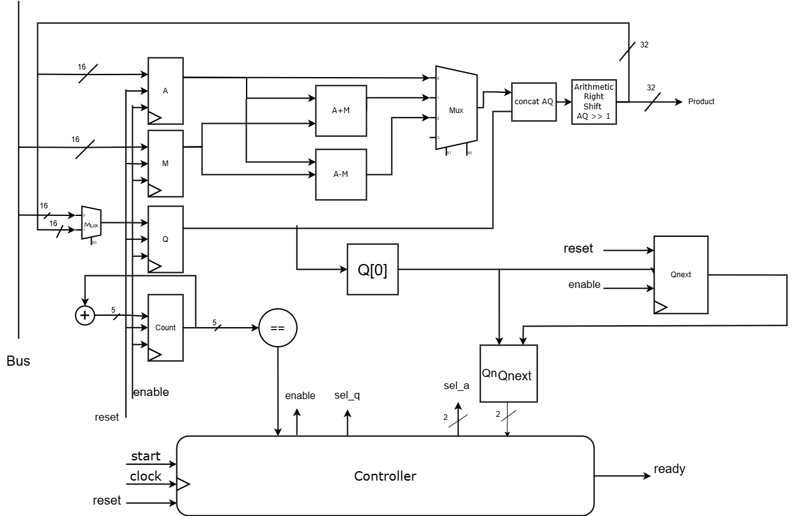
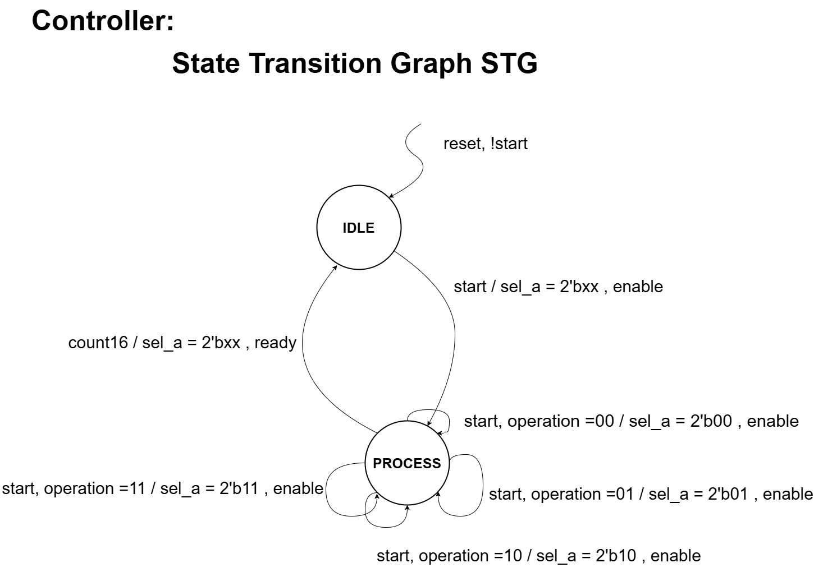

# 16-bit Sequential Booth Multiplier with cocotb tests environment

## Table of Contents
- [Overview](#overview)
- [Top-Level Module](#top-level-module)
- [Datapath Module](#datapath-module)
- [Datapath Block Diagram](#datapath-block-diagram)
- [Controller Module](#controller-module)
- [Controller State Transition Graph](#controller-state-transition-graph)
- [Sequential Multiplier Integration](#sequential-multiplier-integration)
- [Cocotb Testbench](#cocotb-testbench)
- [Usage Compilation and Simulation](#usage-compilation-and-simulation)

## Overview
This project implements a 16-bit sequential Booth multiplier, designed for efficient multiplication of signed integers. The design features a `Datapath` module for arithmetic operations and a `Controller` module for managing control signals and state transitions. A valid-ready interface is used to manage the data flow between the testbench (source) and the multiplier (destination).


## Top-Level Module
The top-level module integrates the `Datapath` and `Controller` to form the complete multiplier system. It handles the valid-ready interface signals along with the core multiplication inputs and outputs.

### I/O Description
- **Inputs**:
  - **Multiplicand (16-bit)**: The number to be multiplied.
  - **Multiplier (16-bit)**: The number to multiply by.
  - **Clock and Reset**: Standard control signals for synchronous operation.
  - **start**: start the multiplication.

- **Outputs**:
  - **Product (32-bit)**: The final multiplication result.
  - **ready**: Indicates that the output data is ready to read.



## Datapath Module
The `Datapath` module performs the core arithmetic operations, including the Booth multiplication steps and managing internal registers.

## Datapath Block Diagram



## Controller Module
The `Controller` module handles the state machine logic, orchestrating the sequence of operations based on the valid-ready signals and other control inputs.

## Controller State Transition Graph



## Sequential Multiplier Integration
The `seq_multiplier` module combines the `Datapath` and `Controller`, managing the overall operation of the multiplier.

## Cocotb Testbench

### Overview
The Cocotb testbench is written in Python and uses the Cocotb library to provide a high-level interface for writing and running testbenches for HDL designs. This testbench verifies the functionality of the sequential Booth multiplier by applying various test cases and checking the correctness of the multiplication results.

### Testbench Code
The testbench code is located in `tests/sequential_multiplier_tb.py`. It includes the following main components:

- **Initialization and Reset**:
  - **`init_sequence`**: Initializes the inputs of the DUT (Device Under Test).
  - **`reset_sequence`**: Performs a reset(active low, asynchronous) operation on the DUT.

- **Driver**:
  - **`driver`**: Drives the input values into the DUT and starts the multiplication operation.

- **Monitor**:
  - **`monitor`**: Monitors the output of the DUT and checks if the multiplication result matches the expected product within a specified timeout.

### Test Cases
The testbench includes both directed and randomized test cases:

- **Directed Test Cases**: Specific values are tested to ensure the multiplier works correctly for a range of scenarios, including positive, negative, and zero values.

- **Randomized Test Cases**: Random values are generated and tested to cover a broader range of possible inputs.


## Usage Compilation and Simulation

#### Compile and Run
```bash
  make 
```
#### Simulation on gtkwave

```bash 
  make simulate
```

