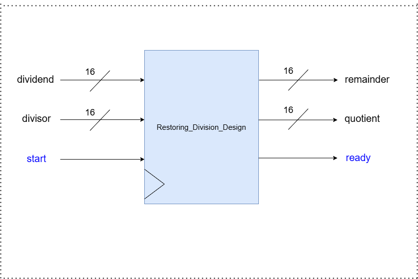
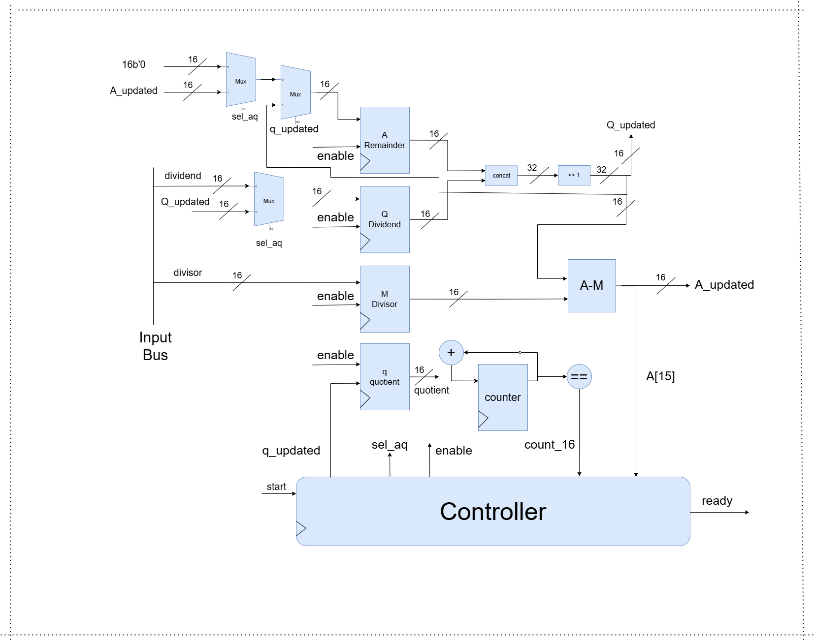
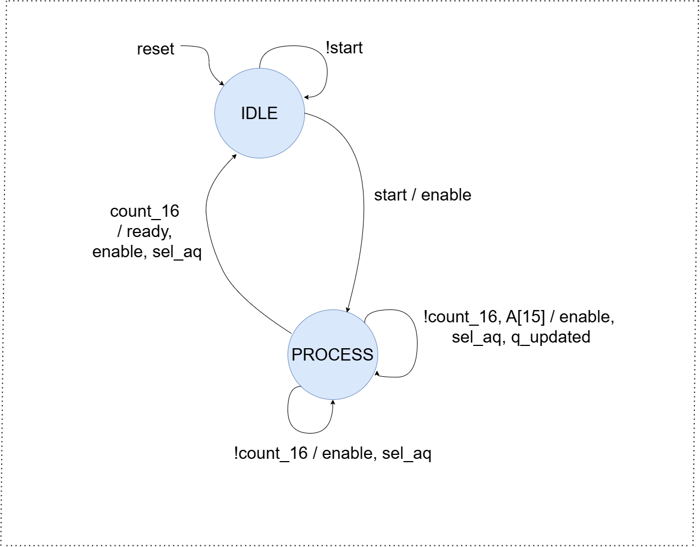

# Restoring Division Algorithm in SystemVerilog

## Table of Contents
1. [Overview](#overview)
3. [Design Files](#design-files)
   - [Top-Level Module](#top-level-module)
   - [Datapath](#datapath)
   - [Controller](#controller)
4. [How to Use](#how-to-use)
5. [Documentation](#documentation)
6. [License](#license)
7. [Contact](#contact)

## Overview

This project implements the restoring division algorithm using SystemVerilog. The design is structured into three main modules: `top_level`, `datapath`, and `controller`. Each module plays a crucial role in the division process, and together they facilitate efficient division of 16-bit integers.

## Design Files

### Top-Level Module



The top-level module integrates the datapath and controller modules and manages the interface for input and output signals. The module has the following inputs and outputs:

#### Inputs:
- `dividend` : The 16-bit dividend for the division operation.
- `divisor`  : The 16-bit divisor for the division operation.
- `start`    : A control signal to start the division process.
- `clk`      : The clock signal for synchronous operation.
- `reset`    : A reset signal to initialize or clear the module.

#### Outputs:
- `quotient` : The 16-bit quotient resulting from the division.
- `remainder` : The 16-bit remainder resulting from the division.
- `ready` : A signal indicating when the division operation is complete and the results are available.


### Datapath



The datapath module is responsible for executing the restoring division algorithm. It includes the arithmetic operations and storage elements required for performing division. The datapath processes the dividend and divisor to compute the quotient and remainder.

### Controller



The controller module manages the control signals for the datapath. It generates the necessary control signals to guide the division process, ensuring that operations are performed in the correct sequence. The controller also handles the start and reset signals and indicates when the operation is complete.

## Cocotb Testbench

### Overview
The Cocotb testbench is written in Python and uses the Cocotb library to provide a high-level interface for writing and running testbenches for HDL designs. This testbench verifies the functionality of the sequential Booth multiplier by applying various test cases and checking the correctness of the multiplication results.

### Testbench Code
The testbench code is located in `tests/restoring_division_tb.py`. It includes the following main components:

- **Initialization and Reset**:
  - **`init_sequence`**: Initializes the inputs of the DUT (Device Under Test).
  - **`reset_sequence`**: Performs a reset(active low, asynchronous) operation on the DUT.

- **Driver**:
  - **`driver`**: Drives the input values into the DUT and starts the division operation.

- **Monitor**:
  - **`monitor`**: Monitors the outputs of the DUT and checks if the division result matches the expected remainder and quotient within a specified timeout.

### Test Cases
The testbench includes both directed and randomized test cases:

- **Directed Test Cases**: Specific values are tested to ensure the division works correctly for a range of scenarios, including division by one, zero over something, some large values for dividend and divisor.

- **Randomized Test Cases**: Random values are generated and tested to cover a broader range of possible inputs.


## How to Use

1. **Compile**: Use a SystemVerilog-compatible compiler(icarus or iverilog) to compile the design files.

   ```bash
        make 
   ```

2. **Simulation**: Use gtkwave simulator to view the wave of design.

    ```bash
        make simulate
    ```

