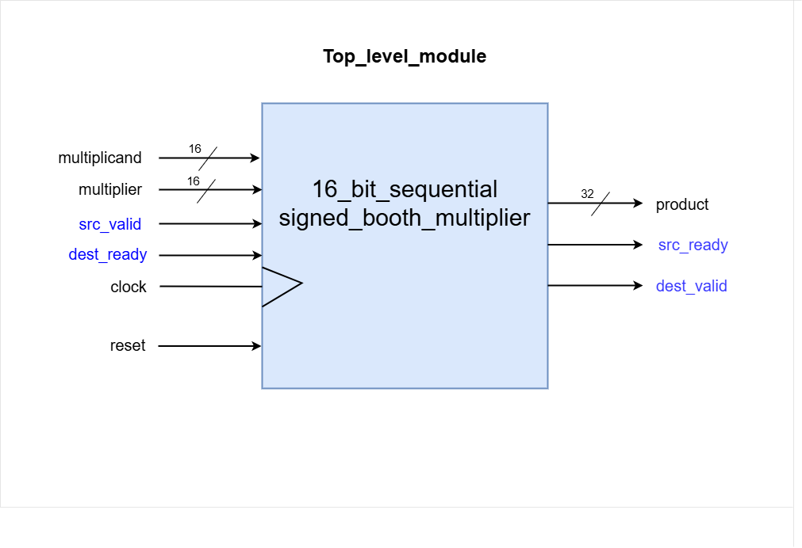
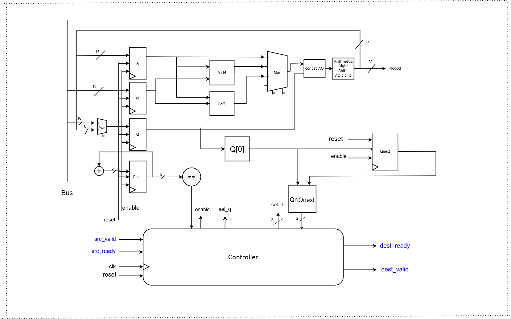
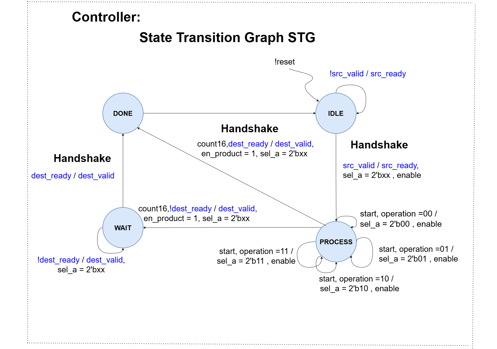

# 16-bit Sequential Booth Multiplier with Valid-Ready Interface

## Table of Contents
- [Overview](#overview)
- [Valid-Ready Interface](#valid-ready-interface)
- [Top-Level Module](#top-level-module)
- [Datapath Module](#datapath-module)
- [Datapath Block Diagram](#datapath-block-diagram)
- [Controller Module](#controller-module)
- [Controller State Transition Graph](#controller-state-transition-graph)
- [Sequential Multiplier Integration](#sequential-multiplier-integration)
- [Usage Compilation and Simulation](#usage-compilation-and-simulation)

## Overview
This project implements a 16-bit sequential Booth multiplier, designed for efficient multiplication of signed integers. The design features a `Datapath` module for arithmetic operations and a `Controller` module for managing control signals and state transitions. A valid-ready interface is used to manage the data flow between the testbench (source) and the multiplier (destination).

## Valid-Ready Interface
The valid-ready interface is used in this project to manage the flow of data between the testbench (acting as the source) and the `seq_multiplier` design (acting as the destination). This interface ensures that data is transferred only when both the testbench and the multiplier are ready, maintaining data integrity and synchronization.


### Purpose
- **Data Integrity**: Ensures that the data (multiplicand and multiplier) is accurately transferred and processed without loss.
- **Flow Control**: Manages when new data can be accepted by the multiplier, preventing buffer overflow or underflow.
- **Synchronization**: Coordinates the timing between the testbench and the multiplier, ensuring they operate in harmony.

### Signals
- **Inputs to `seq_multiplier`**:
  - **src_valid**: Indicates that the testbench(source) has valid data available (multiplicand and multiplier).
  - **dest_ready**: Indicates that the testbench(source) is ready read data from seq_multiplier(destination), product in our case.

- **Outputs from `seq_multiplier`**:
  - **src_ready**: Indicates that the seq_multiplier(destination) is ready to accept the data from testbench(source)
  - **dest_valid**: Indicates that the multiplication result obtained by seq_multiplier is valid and ready to be read by the testbench.

## Top-Level Module
The top-level module integrates the `Datapath` and `Controller` to form the complete multiplier system. It handles the valid-ready interface signals along with the core multiplication inputs and outputs.

### I/O Description
- **Inputs**:
  - **Multiplicand (16-bit)**: The number to be multiplied.
  - **Multiplier (16-bit)**: The number to multiply by.
  - **Clock and Reset**: Standard control signals for synchronous operation.
  - **src_valid**: Indicates valid input data is present.
  - **dest_ready**: Indicates that source is ready to accept final output.

- **Outputs**:
  - **Product (32-bit)**: The final multiplication result.
  - **src_ready**: Indicates that design is ready to accept new data.
  - **dest_valid**: Indicates that the output data is valid and can be read.



## Datapath Module
The `Datapath` module performs the core arithmetic operations, including the Booth multiplication steps and managing internal registers.

## Datapath Block Diagram



## Controller Module
The `Controller` module handles the state machine logic, orchestrating the sequence of operations based on the valid-ready signals and other control inputs.

## Controller State Transition Graph



## Sequential Multiplier Integration
The `seq_multiplier` module combines the `Datapath` and `Controller`, managing the overall operation of the multiplier and the interface with external systems via the valid-ready protocol.

## Usage Compilation and Simulation

#### Compile and Run
```bash
  make 
```
```bash
  make all
```
```bash
  make run
```

#### Delete .o . vcd and .exe file

```bash
  make clean
```

#### Simulation

```bash 
  make simulate
```

