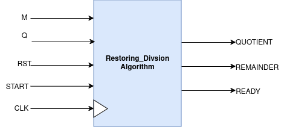

# 16x16 Sequential Signed Multiplier

## Introduction
Restoring divison alogorithm to find QUOTIENT and REMAINDER.
**Q(dividend)** and **M(divisor)** are my inuts and **QUOTIENT** and **REMAINDER** are outputs.<br>
Used **START** in and **READY** in incase of this algorithm.<br>
Mealy state machine conist up on only two stages S0, S1.<br>
Total 16 Clock Cycles required for valid output .<br>
The testbenches are directed test cases.<br>

### Usage: Automated for Modelsim

To execute the code and view the waveform on Multisim, simply use the following command:
```
make 
```

Once you've completely executed the code, don't forget to clean extra files through:
```
make clean
```

## Design Details

### Top Level Diagram


### Ready Valid HandShake Mechanism


### Datapath


### Controller


### Simulation Waveform


### Gate Counts

| Module                  | Total Count | Gate Count |
| ----------------------- | ----------- | ---------- |
| 16 bit 2's Compliment   | 1           | 81         |
| 2x1 MUX                 | 4           | 16         |
| 5'b Equal Comparator    | 1           | 29         |


### Gate Count 
**Restoring_Division_Algorithm:** <br>
==> 16 bit 2's Compliment  = 16*5 + 1 = 81<br>
==> 2x1 MUX  = 4 * 4 = 16<br>
==> 5'b Equal Comparator  = 5 * 5 + 4 = 29 <br>
==> Total Gate Count = 81 + 16 + 29 = **198 gates**<br>

