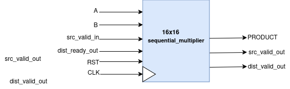
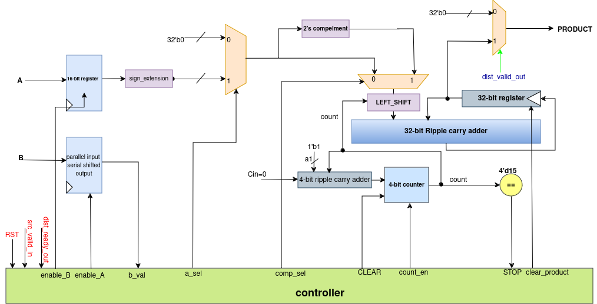
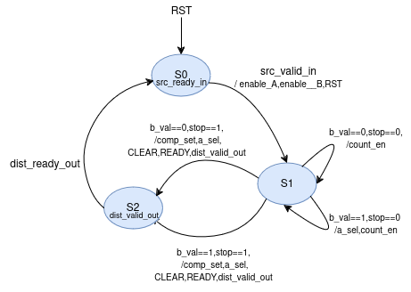

# 16x16 Sequential Signed Multiplier

## Introduction
Ready valid handshake sequential multiplier.
A and B are inputs, PRODUCT is output.<br>
Used **src_valid** in and **src_ready** in incase of Source to Multiplier.<br>
Used **src_valid** out and **src_ready** out incase of Destination to Multiplier.<br>
Mealy state machine conist up on only two stages S0, S1, S2.<br>
Total 16 Clock Cycles required for valid output .<br>
The testbenches are directed test cases.<br>

### Usage: Automated for Modelsim

To execute the code and view the waveform on Multisim, simply use the following command:
```
make 
```

Once you've completely executed the code, don't forget to clean extra files through:
```
make clean
```

## Design Details

### Top Level Diagram


### Ready Valid HandShake Mechanism


### Datapath


### Controller


### Simulation Waveform


### Gate Count

| Module                  | Total Count | Gate Count |
| ----------------------- | ----------- | ---------- |
| 32'b Ripple Carry Adder | 1           | 160        |
| 4'b Ripple Carry Adder  | 1           | 20         |
| 32 bit 2's Compliment   | 1           | 161        |
| 2x1 MUX                 | 3           | 12         |
| 4'b Equal Comparator    | 1           | 23         |


### Gate Count Comparision
**Combinational_Multiplier:** <br>
In case of 16x16 combinational multiplier there were 376 full adders and 11 half adders. <br>
==> Total Gate Count = (376*5) + (11*2) = **1902 gates** <br>
**Sequential_Multiplier:** <br>
In this case 4-bit ripple carry adder consist up 4 full adders,so that 1 full adder consist <br>
up 5 gates.<br>
==> 4-bit ripple carry adder = 4 * 5 = 20<br>
==> 32-bit ripple carry adder = 32 * 5 = 160<br>
==> Total Gate Count = 160 + 20 + 161 + 12 + 23 = **376 gates**<br>

