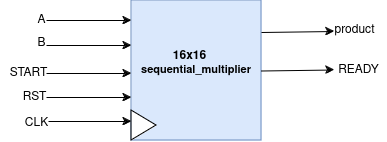
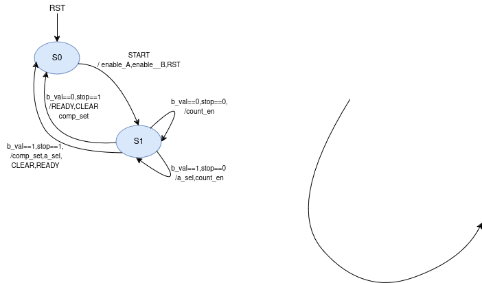

# 16x16 Sequential Signed Multiplier

## Introduction

16x16 bit sequential signed multiplier.
A and B are inputs, PRODUCT is output.
Mealy state machine conist up on only two stages S0 and S1.
Total 16 Clock Cycles required for valid output .
The testbenches will randomly test for a number of inputs and also supports directed test tasks.

### Usage: Automated for Multisim

To execute the code and view the waveform on Multisim, simply use the following command:
```
make simulator
```

To execute the code on command line, simply use the following command:
```
make run
```

Once you've completely executed the code, don't forget to clean extra files through:
```
make clean
```

## Design Details

### Top Level Diagram



### Datapath


### Controller


### Gate Count

| Module                  | Total Count | Gate Count |
| ----------------------- | ----------- | ---------- |
| 32'b Ripple Carry Adder | 1           | 160        |
| 4'b Ripple Carry Adder  | 1           | 20         |
| 32 bit 2's Compliment   | 1           | 161        |
| 2x1 MUX                 | 3           | 12         |
| 4'b Equal Comparator    | 1           | 23         |


### Gate Count Comparision
**Combinational_Multiplier:**
In case of 16x16 combinational multiplier there were 376 full adders and 11 half adders. 
==> Total Gate Count = (376*5) + (11*2) = **1902 gates**
**Sequential_Multiplier:**
In this case 4-bit ripple carry adder consist up 4 full adders,so that 1 full adder consist up 5 gates.
==> 4-bit ripple carry adder = 4 * 5 = 20
==> 32-bit ripple carry adder = 32 * 5 = 160
==> Total Gate Count = 160 + 20 + 161 + 12 + 23 = **376 gates**

