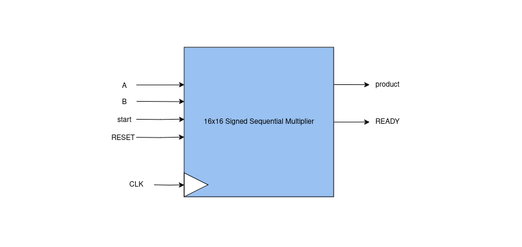
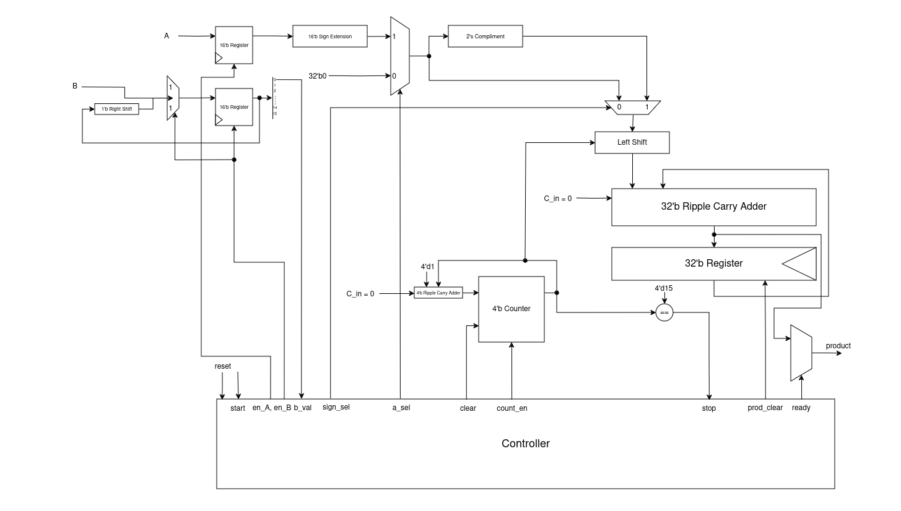
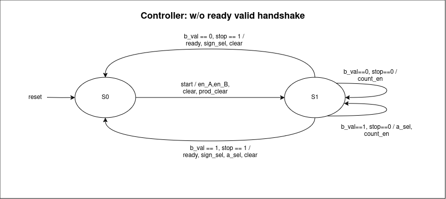
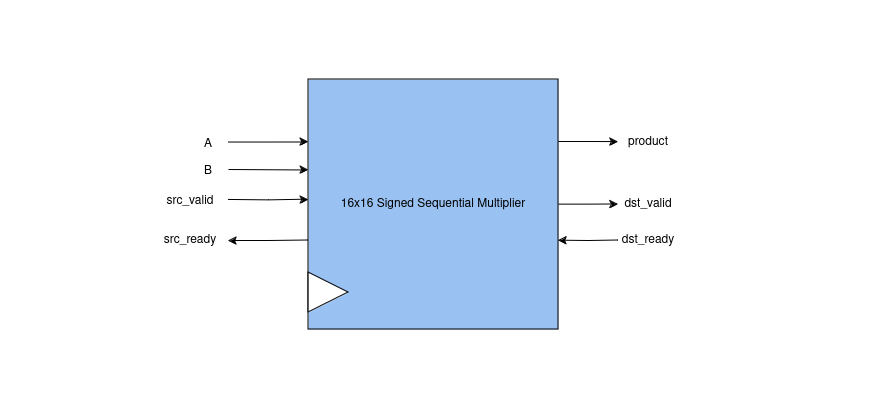
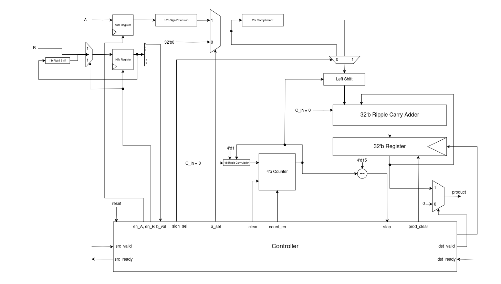
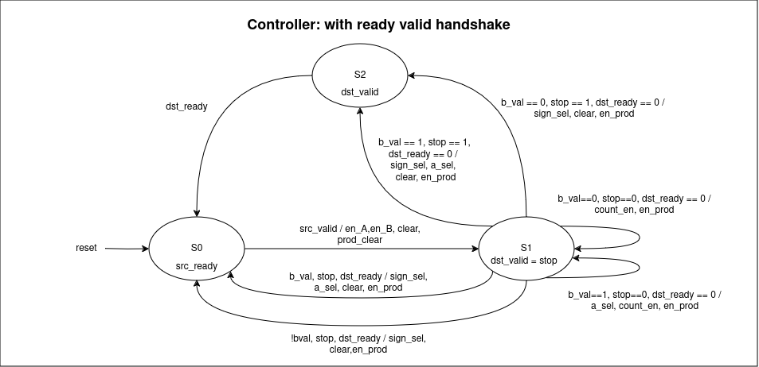

# 16x16 Sequential Signed Multiplier

## Introduction

16x16 bit sequential signed multiplier.
<br>
<br>
**Type 1:** 16x16 Sequential Signed Multiplier w/o ready-valid handshake - Requires total of 16 clock cycles for valid output<br>
**Type 2:** 16x16 Sequential Signed Multiplied with ready-valid handshake - Requires total of 16 clock cycles for valid output
<br>

A and B are inputs, product is output.
<br>
In type 1, total memory of **1 bit** used in Mealy FSM.<br>
In type 2, total memory of **2 bits** used in Mealy FSM.
<br><br>
**Testbench for Type 1:** The testbench will randomly test for a number of inputs and also supports directed test tasks. However, unmodified testbench will randomly test for 10 million random inputs.
<br>
**Testbench for Type 2:** The testbench will perform directed tests for each type of ready-valid handshake. It will also randomly test for a number of inputs which are provided to be 1000000 in count variable.
<br>

## Usage: Automated for Modelsim

Path to Multiplier w/o ready-valid handshake: `Salman/assignments/module10/src/non_ready_valid`
<br>
Path to Multiplier with ready-valid handshake: `Salman/assignments/module10/src/ready_valid`
<br>

To execute the code and view the waveform on Multisim, simply use the following command:
```
make simulate
```

To execute the code on command line, simply use the following command:
```
make run
```

You can also decide the runtime for your code using the following command:
```
make run RUNTIME=xxxx
```
OR
```
make simulate RUNTIME=xxxx
```

Once you've completely executed the code, don't forget to clean extra files through:
```
make clean
```

# Design Details

## Type 1: Multiplier w/o ready-valid handshake

### Top Level Diagram



### Datapath


### Controller


## Type 2: Multiplier with ready-valid handshake

### Top Level Diagram



### Datapath


### Controller



# Gate Count

| Module                  | Total Count | Gate Count |
| ----------------------- | ----------- | ---------- |
| 32'b Ripple Carry Adder | 1           | 160        |
| 4'b Ripple Carry Adder  | 1           | 20         |
| 32 bit 2's Compliment   | 1           | 161        |
| 2x1 MUX                 | 4           | 12         |
| 4'b Equal Comparator    | 1           | 7          |


Total Gate Count in Sequential Multiplier is: 360 

Total Gate Count in Combinational Multiplier is: 1413
