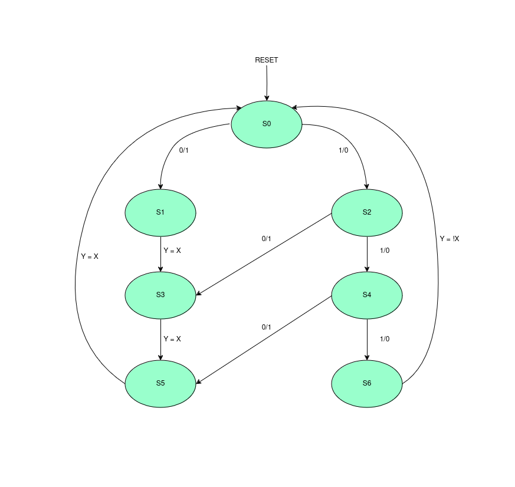
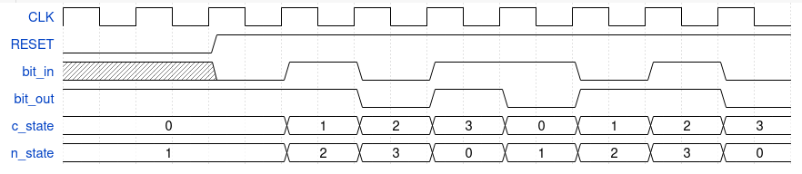

# 4 Bit Plus One Adder 

## Introduction

4 bit plus one adder state machine diagram.
bit_in is input, bit_out is output
Total memory of 3 Bit for Finite State Machine.
Total of 4 clock cycles required for a valid output.

### Usage: Automated for Multisim

Path to code: Salman/assignments/module9/src

To execute the code and view the waveform on Multisim, simply use the following command:
```
make
```

This command will automatically compile and execute the code for you and provide you with its waveform. You can view the output result on the Multisim default window.

Once you've completely executed the code, don't forget to clean extra files through:
```
make clean
```

## Design Details

### State Machine Diagram



### Waveform

