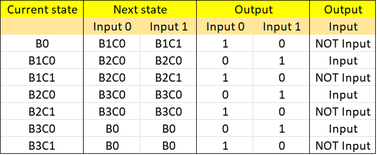
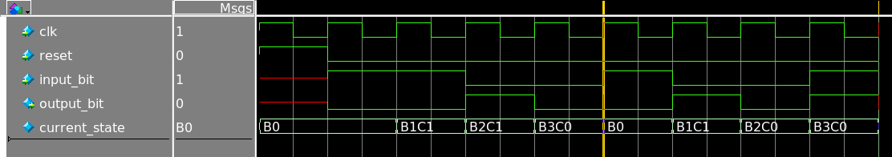

# Add-1 design
Language: System Verilog

Adds 1 to the input number.\
Input is given serially (bit by bit), and can be of any length. Reset before inputting a new number.

### Working

The adder has been implemented as a state machine.

The state remembers the current bit position and the carry: current state of B1C0 means that the next input bit is bit 1 and there is no carry, while state B2C1 means bit 2 and 1 carry. State B0 represnts the bit 0 (lsb), and there is no carry.

### Build
ModelSim is used as System Verilog simulator.
- `make compile` 
Compiles the System Verilog files.

- `make simulate`
Runs the compile target if required. Default simulation tests Add1 module for all 4 bit numbers and displays results on console.

- `make clean`
Deletes the work folder produced by ModelSim.

### Static tests
In Add1_tb.sv, task *test(input_number)* inputs bits input_number to Add1_4bit and checks the output bits.

To run test on number X, write *test(X);* in the Add1_tb.sv

The above figure shows waveform of Add1_4bit module being tested on two numbers: 3 and 9 being passed to Add1_4bit module bit by bit at (the yellow cusor seperates the numbers. see input_bit). Corresponding output_bit values make 4 and 10 respectively.