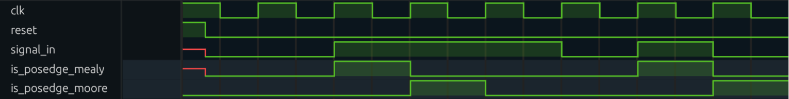

# Posedge detector
Language: SystemVerilog

Detects input signal's transition from 0 to 1.\
Has two implemataions: moore state machine and mealy state machine.

```
Inputs: clk             : clock signal
        reset           : reset signal
        signal_in       : serial input signal

Output: is_posedge      : =1 at transition of signal_in for 1 clock cycle
                          =0 else
```

### Run tests
Uses ModelSim as SystemVerilog simulator.

`make compile`\
Compiles the modules source files and testbench.\
PHONY target for make work/_lib.qdb

`make simulate`\
Simulates modules. Generates vcd file: wavefrom.vcd\
Runs compile target if required.\
PHONY target for make waveform.vcd.\
See simulation options.

`make clean`\
Cleans the simulation files: work directory and  transcript.

### Simulation options
These parameters can be set on simulation time.\
For example: `make simulate SIMTIME="10 ms" SIGNAL=1010111`

`SIMTIME` (default 100ps)\
Running time of simulation. Requires a larger value for longer tests.
If simulation exits without any message, try increasing SIMTIME.

`SIGNAL` (default 00111010)\
Binary sequence that is given as input signal to the state machines to detect its transitions from 0 to 1 (positve edges).

### Waveform


### State machines
Moore machine:\


Mealy machine:\

