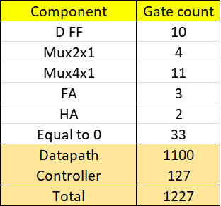

# Sequential Signed Multiplier Design

Language: SystemVerilog

Multiplies two 16 bit signed numbers sequentially in max 32 clock cycles.\
Sets ready signal when product is available.

Paramater: NUMBITS  : width (number of bits) of multiplier and multiplicand.

Inputs: clk         : clock signal
        reset       : reset signal (active low)
        start       : start computing product.
        numA, numB  : <NUMBITS> wide multiplier and multiplicand.
                        Must be stable for 1 clock cycle after start signal.

Outputs: ready      : set to 1 when result (product) is available
         product    : <2*NUMBITS> wide result of numA * numB.

### Run tests
ModelSim is used as SystemVerilog simulator.

Use makefile to run random tests on the unit.

`make compile`\
Compiles the modules source files and testbench.\
PHONY target for make work/_lib.qdb

`make simulate`\
Simulates random tests on SequentialSignedMultiplier module. Displays messages on console and in transcript file.\
Runs compile target if required.\
PHONY target for make transcript.\
See simulation options.

`make clean`\
Cleans the simulation files: work directory and  transcript.

### Simulation options
These parameters can be set on simulation time.\
For example: `make simulate SIMTIME="10 ms" NUMTESTS=1e6`

`SIMTIME` (default 1ms)\
Running time of simulation. Requires a larger value for longer tests.
If simulation exits without any message, try increasing SIMTIME.

`NUMTESTS` (default 1e4)\
Number of times to run random tests on the module.\

### C model
Model of SequentialSignedMultiplier module written in C.\
Path: "docs/C model/SequentialSignedMultiplier.c"

### Structure
Top level diagram:\

Controller, datapath connections:\

Datapath:\

Controller:\

#### Gate count
