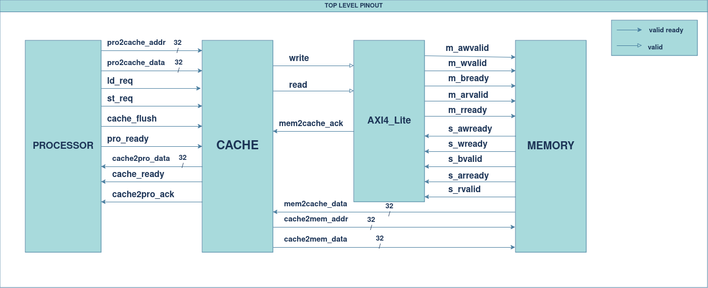
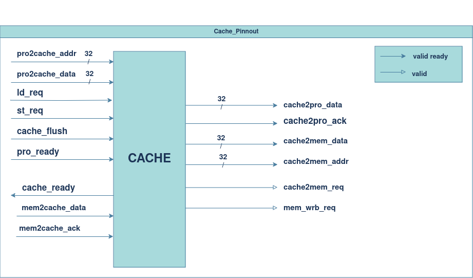
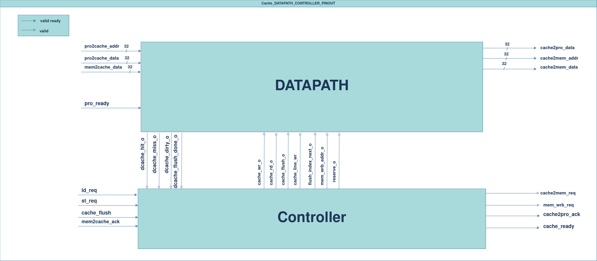
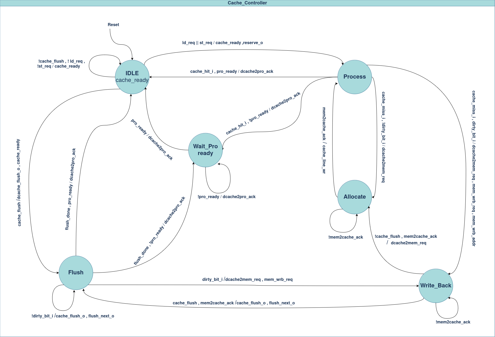
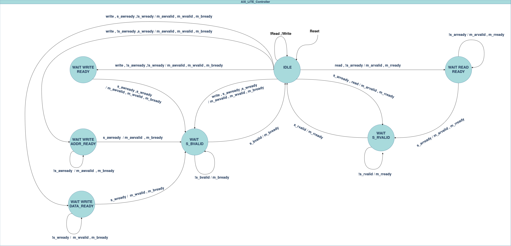
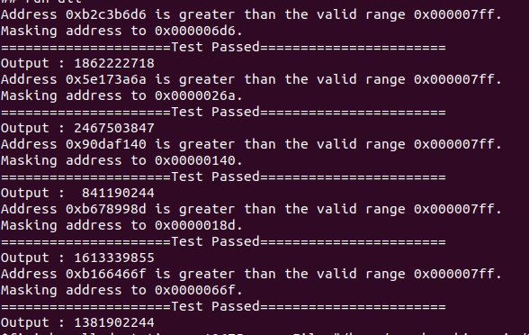

# AXI4-LITE Compliant Cache Controller

## Overview
  This repository contains an implementation of AXI4 Lite compliant Cache controller with the memory module in the test bench for the testing purposes . You can be used for any size of the cache by changing different parameters of the cache in the header file.

## Languages Used
  * System Verilog
  * C++
  * Makefile 


## Environments Used

  * Linux Ubuntu 22.04.2

# System Design Overview

  Representation of architecture through clear block diagrams is shown below.
## Top-Level Pinout Diagram


## Cache Pinout


## Datapath and Controller Pinout


## Cache Controller


## AXI4-LITE Controller


***Note:***
- The inputs that are not written in the STG are treated as don't  care .
- The outputs that are not written  in the STG are treated as zero.

# Getting Started


## Installation of Vivado  

Install [Vivado](https://github.com/ALI11-2000/Vivado-Installation) and [Verilator](https://verilator.org/guide/latest/install.html). Follow the instructions provided in the corresponding links to build these tools.

## Build Model and Run Simulation

To build Signed Combinational Multiplier, use the provided Makefile. Follow the steps below for simulation using Verilator or Vivado.

### Simulation with Verilator
Run the following command to simulate using Verilator:

```markdown
  make verilator
```


To view the waveform generated by Verilator, execute:

```markdown
make ver_waves
 ```
### Simulation with Vivado
For simulation on vivado run the following command:

```markdown
make 
```

The waves on vivado will be created that can be viewed by running

```markdown
make viv_waves
``` 
### Simulation with Vsim
For simulation on vsim run the following command:

```markdown
make vsim
```

The waves on modelsim will be created that can be viewed by running

```markdown
make vsim_simulate
``` 

# Successful Implementation

### Implementation with Vivado and Modelsim

Running the `make vivado`or `make vsim ` command generates the terminal log output as shown below:

 

