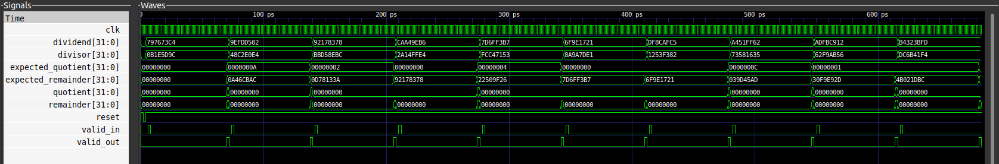

# nxn Restoring Divider

## Overview
  This repository contains an implementation of n bit restoring divider  can be used for any size by changing the width of inputs and output in the header file.

## Languages Used
  * System Verilog
  * C++
  * Makefile 
  * Python


## Environments Used

  * Linux Ubuntu 22.04.2

# System Design Overview

  Representation of architecture through clear block diagrams is shown below.
## Pinout Diagram
The Pinout diagram of the signed array  multiplier with val_redy interface  is given below.


## Datapath


## Controller


***Note:***
- The inputs that are not written in the STG are treated as don't  care .
- The outputs that are not written  in the STG are treated as zero.

# Getting Started


## Installation of Vivado  

* Install [Vivado](https://github.com/ALI11-2000/Vivado-Installation) and [Verilator](https://verilator.org/guide/latest/install.html). Follow the instructions provided in the corresponding links to build these tools.

* Install [Cocotb](https://www.youtube.com/watch?v=WIKXy5tYCp4&list=PL3Z0z1uoFF-CElbEpGoRa5ph-TJUzuKnm) . Follow the video upto **4:38 sec** to set the environment and then change the directory where the project is placed. Make sure to activate the environment by `source venv/bin/activate` every time before running the `make cocotb`  

## Build Model and Run Simulation

To build Signed Combinational Multiplier, use the provided Makefile. Follow the steps below for simulation using Verilator or Vivado.

### Simulation with Verilator
Run the following command to simulate using Verilator:

```markdown
  make verilator
```


To view the waveform generated by Verilator, execute:

```markdown
make ver_waves
 ```
### Simulation with Vivado
For simulation on vivado run the following command:

```markdown
make 
```

The waves on vivado will be created that can be viewed by running

```markdown
make viv_waves
``` 
### Simulation with cootb
For simulation on cocotb run the following command:

```markdown
make cocotb
```

The waves on gtkwave will be created that can be viewed by running

```markdown
gtkwave test/restoring_division.vcd
``` 

# Successful Implementation

## Implementation with Verilator

Upon successful execution of the `make verilator` command, the terminal log output for Uart Transmitter and Receiver, is presented below:

 

### Implementation with Vivado

Running the `make vivado` command generates the terminal log output as shown below:

 

### Implementation with Cocotb

Running the `make cocotb` command generates the terminal log output as shown below:

 

# Output Waveform 
The waveform is shown below:
## Vivado
 

The waveform is shown below:
## GTKWAVE
 

