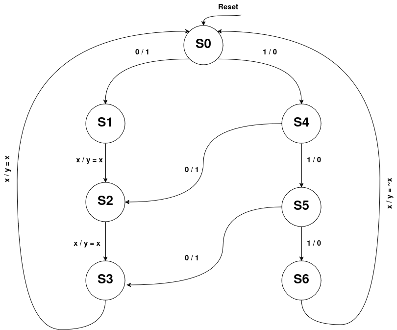
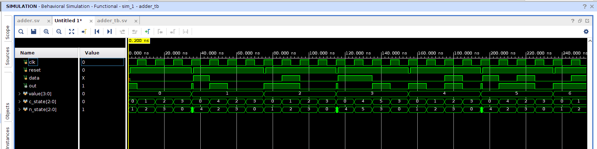
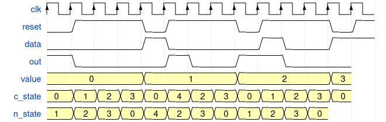

# ADDER 

## Overview
  This repository contains an implementation of adder that adds 1 to a four bit number using the finite state machine(FSM) 

## Languages Used
  * System Verilog
  * Makefile 


## Environments Used

  * Linux Ubuntu 22.04.2

# System Design Overview

  Representation of architecture through clear block diagrams is shown below.
## State Machine
The  state machine of the adder is given below.



## Description of State Machine 
* At reset we are in **S0** state

* If the input is **0**  means LSB is **0** we add **1** to it and the output is **1**. Carry is **0**. Next state is **S1**

* If the input is **1**  means LSB is **1** we add **1** to it and the output is **0**. Carry is **1**. Next state is **S4**

* Now , if the input was **0** and we had added **1** in it and got the **1**  as an output and now come to **S1** .\
Now, whatever will be input that will be at output and we will move to next state because we have already done with the addition of **1**.Carry out will be **0**. Next state is **S2**

* Same description for the above point applies to state **S2** and **S3**.<br />  But when we  are in **S3** state the input comes and will be displayed at the output due to above reason . The next State will be **S0** now because we are done with the four bit number and had added **1** to it .

* Now , if the input was **1** and we had added **1** in it and got the **0**  as an output and now come to **S4** .\
Now, if the input is **1** the output will be **0** because of the previous carry that was **1** and we go to satate **S5**.<br />
Now, if the input is **0**  the output will be **1** because of the previous carry that was **1** and we are done with the addition of 1 .now we go to state **S2** and then go through the same path followed by any input that came when we are in **S2**

* Now , if the input was **1** and we had added **1** in it and got the **0**  as an output and now come to **S5** .\
Now, if the input is **1** the output will be **0** because of the previous carry that was **1** and we go to satate **S6**.<br />
Now, if the input is **0**  the output will be **1** because of the previous carry that was **1** and we are done with the addition of 1 .now we go to state **S3** and then go through the same path followed by any input that came when we are in **S3**

* Now , if we are in **S6** whatever will be the input negation of it will be displayed at the output. And we will got to **S0** state as we rae done with the additioon of **1** in four bit number.   
 

# Getting Started


## Installation of Vivado  

Install [Vivado](https://github.com/ALI11-2000/Vivado-Installation) . Follow the instructions provided in the corresponding links to build these tools.

## Build Model and Run Simulation

To build Adder, use the provided Makefile. Follow the steps below for simulation using  Vivado.


### Simulation with Vivado
For simulation on vivado run the following command:

```markdown
make 
```

The waves on vivado will be created that can be viewed by running

```markdown
make viv_waves
``` 

# Successful Implementation

### Implementation with Vivado

Running the `make viv_waves` command generates the terminal log output as shown below:

 

# Waveform Drawn

The expected waveform is shown below:

 

 

