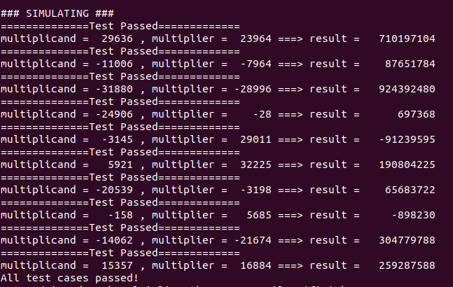

# Combination Signed Multiplier

## Overview
  This repository contains an implementation of 16 bit signed multiplier but can be used for any size by changing the width of inputs and output in the header file.

## Languages Used
  * System Verilog
  * C++
  * Makefile 


## Environments Used

  * Linux Ubuntu 22.04.2

# System Design Overview

  Representation of architecture through clear block diagrams is shown below.
## Block Diagram
The block diagram of the  combinational signed multiplier is given below.


## Signed Multiplication Algorithm
  * Take the **compliment** of the every **partial product MSB** except the **last partial product**
  * Take the **compliment** of **last partial product each bit except MSB**
  * Add 1 at the **n+1** position and at **2n** position


# Getting Started


## Installation of Vivado  

Install [Vivado](https://github.com/ALI11-2000/Vivado-Installation) and [Verilator](https://verilator.org/guide/latest/install.html). Follow the instructions provided in the corresponding links to build these tools.

## Build Model and Run Simulation

To build Signed Combinational Multiplier, use the provided Makefile. Follow the steps below for simulation using Verilator or Vivado.

### Simulation with Verilator
Run the following command to simulate using Verilator:

```markdown
  make verilator
```


To view the waveform generated by Verilator, execute:

```markdown
make ver_waves
 ```
### Simulation with Vivado
For simulation on vivado run the following command:

```markdown
make 
```

The waves on vivado will be created that can be viewed by running

```markdown
make viv_waves
``` 

# Successful Implementation

## Implementation with Verilator

Upon successful execution of the `make verilator` command, the terminal log output for Uart Transmitter and Receiver, is presented below:

 

### Implementation with Vivado

Running the `make vivado` command generates the terminal log output as shown below:

 

# Output Waveform 

The waveform is shown below:
## Vivado
 

## GTKWAVE
 

# Waveform Drawn

The expected waveform is shown below:
 
